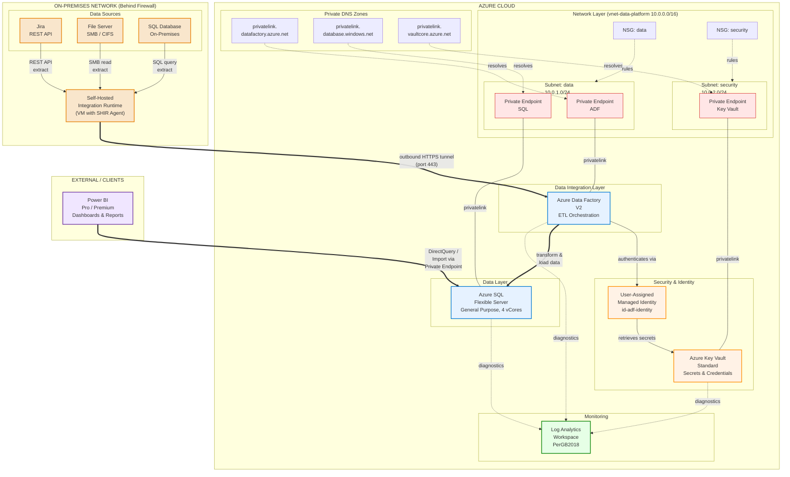

# Azure Architecture: Data Ingestion & Analytics Platform

**Pattern**: On-Premises Data Ingestion via Azure Data Factory
**Region**: East US (primary)
**DRCP Compliant**: Yes
**Generated**: 2026-03-11

## Overview

This architecture enables a team to ingest data from multiple on-premises sources — Jira (REST API), a file server (SMB/CIFS), and a SQL database — into Azure using Azure Data Factory with a Self-Hosted Integration Runtime (SHIR). The SHIR agent runs on an on-premises VM behind the corporate firewall, establishing an outbound HTTPS tunnel to Data Factory without requiring inbound firewall rules.

Data Factory orchestrates ETL pipelines that extract raw data from on-premises sources, apply transformations (data cleansing, schema mapping, deduplication), and load the results into Azure SQL Database (Flexible Server). Power BI connects to Azure SQL via a private endpoint-enabled gateway to deliver dashboards and reports to business users.

All Azure PaaS services are locked down with private endpoints inside a Virtual Network, secrets are managed in Key Vault accessed via User-Assigned Managed Identity, and diagnostics from every resource flow to a central Log Analytics Workspace — meeting all DRCP non-negotiable requirements.

## Resource Inventory

| Resource Name | Type | Tier/SKU | Location | Notes |
|--------------|------|----------|----------|-------|
| adf-data-ingestion | Data Factory | V2 | East US | Orchestrates all ETL pipelines |
| shir-onprem-vm | Self-Hosted Integration Runtime | N/A (on-prem VM) | On-Premises | Outbound HTTPS tunnel to ADF |
| sql-flexible-analytics | Azure SQL Database (Flexible Server) | General Purpose, 4 vCores | East US | Target data store |
| kv-data-ingestion | Key Vault | Standard | East US | Connection strings, credentials |
| id-adf-identity | User-Assigned Managed Identity | N/A | East US | ADF authentication to KV & SQL |
| vnet-data-platform | Virtual Network | 10.0.0.0/16 | East US | Houses all private endpoints |
| snet-data | Subnet: data | 10.0.1.0/24 | East US | ADF, SQL private endpoints |
| snet-security | Subnet: security | 10.0.2.0/24 | East US | Key Vault private endpoint |
| nsg-data | Network Security Group | N/A | East US | Applied to data subnet |
| nsg-security | Network Security Group | N/A | East US | Applied to security subnet |
| pe-adf | Private Endpoint (ADF) | N/A | East US | Data Factory portal & dataFactory |
| pe-sql | Private Endpoint (SQL) | N/A | East US | SQL Flexible Server |
| pe-kv | Private Endpoint (KV) | N/A | East US | Key Vault |
| pdnsz-adf | Private DNS Zone | privatelink.datafactory.azure.net | East US | ADF DNS resolution |
| pdnsz-sql | Private DNS Zone | privatelink.database.windows.net | East US | SQL DNS resolution |
| pdnsz-kv | Private DNS Zone | privatelink.vaultcore.azure.net | East US | Key Vault DNS resolution |
| law-data-platform | Log Analytics Workspace | PerGB2018 | East US | Central diagnostics |
| pbi-reports | Power BI Service | Pro / Premium | External | Reporting & dashboards |

## Architecture Diagram



## Relationship Details

### Network Architecture

All Azure PaaS services (Data Factory, SQL Flexible Server, Key Vault) are accessed exclusively through **private endpoints** within `vnet-data-platform` (10.0.0.0/16). Public network access is disabled on every resource. Two subnets segment traffic:

- **snet-data (10.0.1.0/24)**: Hosts private endpoints for ADF and SQL — the primary data path
- **snet-security (10.0.2.0/24)**: Hosts the Key Vault private endpoint — isolated from data traffic

Each subnet is protected by a dedicated Network Security Group. Private DNS Zones ensure that all privatelink FQDNs resolve to the correct private IP addresses within the VNet.

### Data Flow

```
[On-Prem Sources] --> [SHIR VM] ==(HTTPS 443)==> [Azure Data Factory] ==> [Azure SQL Flexible Server] ==> [Power BI]
```

1. **Extract**: The Self-Hosted Integration Runtime (SHIR) runs on an on-premises Windows VM. It connects locally to Jira (REST API), the file server (SMB), and the on-premises SQL database. No inbound firewall rules are required — SHIR initiates an **outbound HTTPS tunnel** (port 443) to Azure Data Factory's relay endpoint.

2. **Transform**: Data Factory pipelines apply transformations — schema normalization, data type mapping, deduplication, null handling, and business logic enrichment — using Data Flows or Mapping Data Flows.

3. **Load**: Transformed data is written to Azure SQL Flexible Server via the private endpoint. ADF uses the User-Assigned Managed Identity for authentication (no SQL passwords stored).

4. **Present**: Power BI connects to Azure SQL via DirectQuery or scheduled Import refresh, presenting dashboards and reports to business users. The connection traverses the private endpoint for DRCP compliance.

### Identity & Access

| Principal | Target Resource | Access Method | Permissions |
|-----------|----------------|---------------|-------------|
| User-Assigned MI (id-adf-identity) | Key Vault | RBAC (Key Vault Secrets User) | Read secrets |
| User-Assigned MI (id-adf-identity) | Azure SQL Flexible Server | AAD Authentication | db_datareader, db_datawriter |
| Data Factory | SHIR | Service registration | Pipeline execution |
| Power BI Service | Azure SQL Flexible Server | AAD Authentication | db_datareader |

### Diagnostics

Every Azure resource sends diagnostic logs and metrics to `law-data-platform`:

| Resource | Log Categories |
|----------|---------------|
| Data Factory | PipelineRuns, ActivityRuns, TriggerRuns, SSISIntegrationRuntimeLogs |
| SQL Flexible Server | SQLSecurityAuditEvents, QueryStoreRuntimeStatistics |
| Key Vault | AuditEvent |

## DRCP Compliance Checklist

| Requirement | Status | Implementation |
|-------------|--------|---------------|
| Private Endpoints | Enforced | All PaaS services (ADF, SQL, KV) use private endpoints |
| Public Access Disabled | Enforced | `publicNetworkAccess: 'Disabled'` on all resources |
| Managed Identity | Enforced | User-Assigned MI for ADF; no passwords or access keys |
| TLS 1.2+ | Enforced | `minimalTlsVersion: 'TLS1_2'` on SQL and KV |
| VNet Integration | Enforced | All endpoints within vnet-data-platform |
| Diagnostics | Enforced | All resources log to Log Analytics Workspace |
| No Admin Users | Enforced | SQL AAD-only auth; no local admin accounts |
| Private DNS Zones | Enforced | Zones for datafactory, database, vaultcore |

## Notes & Recommendations

- **SHIR High Availability**: Consider deploying 2+ SHIR nodes in an HA group to avoid single-point-of-failure for on-premises data extraction. Data Factory supports multi-node SHIR configurations natively.
- **SQL Backup**: Azure SQL Flexible Server includes automated backups. Confirm geo-redundant backup storage (`GeoRedundant`) is enabled for DR scenarios.
- **Power BI Gateway**: If Power BI needs to reach SQL through the private endpoint, deploy an **On-Premises Data Gateway** or **VNet Data Gateway** to bridge the Power BI service into the VNet.
- **Data Factory Managed VNet**: Consider enabling ADF's **Managed Virtual Network** with managed private endpoints for the Azure IR (used for cloud-side transformations), in addition to the SHIR for on-prem connectivity.
- **Key Vault Soft Delete & Purge Protection**: Ensure both are enabled (DRCP requirement) to prevent accidental secret loss.
