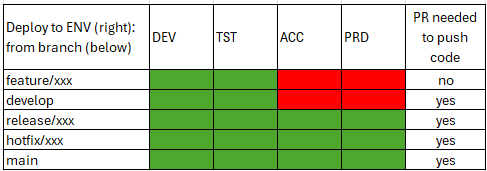
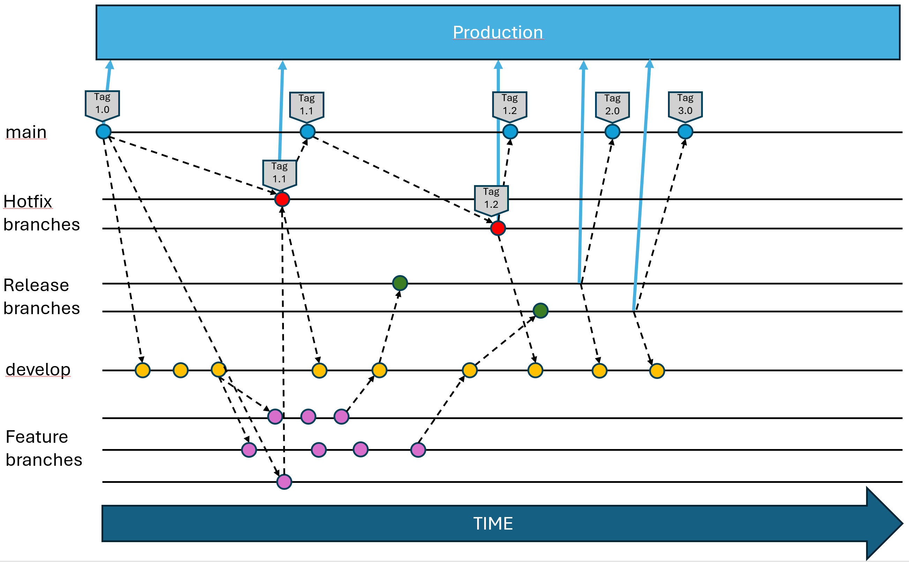
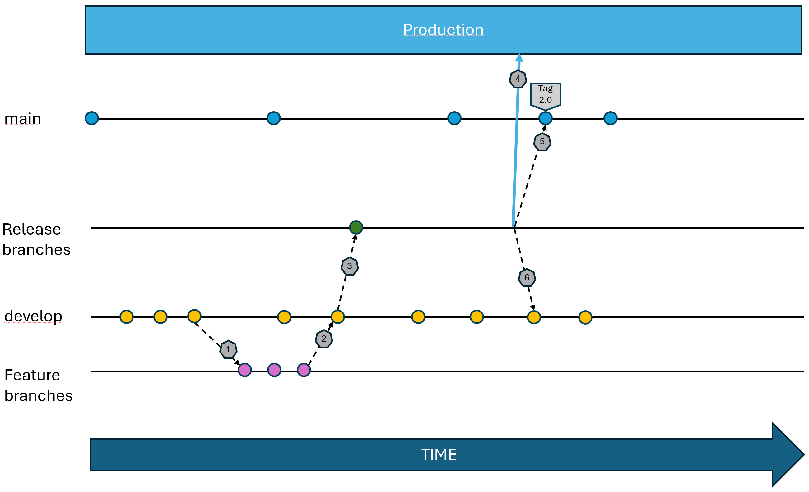
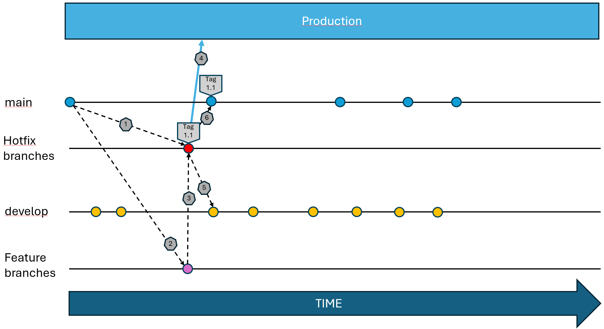

Branch protection
=================

DRCP doesn't allow deployment to acceptance and production for all branches. DRCP requires a pull request (PR) for the branches from which it's allowed to deploy to acceptance or production.
In this way DRCP enforces the 4-eye principle for deployments to acceptance and production.

Protected branches
------------------

DRCP defines a set of protected branches. These branches require a PR and allow deployment to acceptance and production environments.
The platform defines protected branches by the name of the branch, DRCP protects the following branches:

- main.
- develop.
- release/\*.
- hotfix/\*.

The develop branch also requires a PR but DRCP doesn't allow deployment to acceptance or production from this branch.

Tags
~~~~

DRCP allows deployment to acceptance and production from tagged branches and applies the branch protection. DRCP allows deployment to acceptance or production from tags set on protected branches. 
Deployment to acceptance or production from tags set on feature or develop branches isn't allowed. DRCP will create an incident when they detect a not allowed deployment.

Development flow
----------------

This picture depicts a typical development and deployment flow. It's based on `git-flow <https://nvie.com/posts/a-successful-git-branching-model/>`__ with the addition of deployments to production. 
The picture shows 2 long running releases which overlap in time with each other and in one case also with a hotfix.
Merging changes in main to release branches with running tests isn't a option because APG enforces teams to use the same build artifacts through the whole DTAP.
Git applies tags on commits. This means that for instance the team can tag a hotfix branch and after the merge to main the same tag is present for main. Not shown in the picture: the same tag is also present for develop.

Example release flow
~~~~~~~~~~~~~~~~~~~~

This is an example of a release flow.

1. A developer creates a feature branch by branching of from the develop branch.
2. The developer implements the feature and creates a PR to develop. A college has to approve the PR. The DevOps team can use automatic build validation, see :doc:`build validation <Build-validation>`.
3. The DevOps team creates a release branch from the develop branch. The DevOps team deploys the release to acceptance (not shown).
4. After finishing acceptance testing, the DevOps team deploys the release to production.
5. The team merges the release to the main branch and tags the main branch. ``Tags are set on commits, so an alternative is to apply the tag on the release branch before the merge``.
6. The team merges the release to the develop branch.

Example hotfix flow
~~~~~~~~~~~~~~~~~~~

This is an example of a hotfix flow.

1. The DevOps team creates a hotfix branch by branching of from the main branch.
2. The DevOps team creates a feature branch by branching of from the main branch.
3. The developer fixes the bug in the feature branch and creates a PR to the hotfix branch. A college has to approve the PR.
4. The DevOps team tags the hotfix branch and deploys the hotfix to production. An alternative is to tag the hotfix after the merge to production.
5. The team merges the hotfix branch to develop.
6. The team merges the hotfix branch to main.