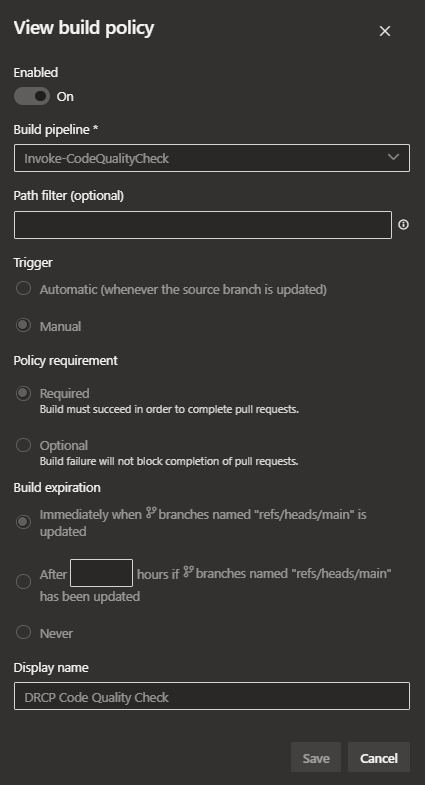

Build validation
================

In this article, you'll learn how the build validation works in Azure DevOps. Build validation relates to :doc:`Settings and policies <Settings-and-policies>`.

Repository
----------

All Azure DevOps projects have two default repositories when newly created. The **DRCPRepo** repository contains the **Invoke-CodeQualityCheck.yml** YAML file in the **pipepelines** folder for the build validation pipeline. DevOps teams can change this file.

The default file contains two jobs that perform the same tasks. The ``condition`` on the jobs determines when it executes. One job runs on a pull request to the **main** branch. The other on a pull request to the **develop** branch. This way you may have different code quality checks on your code.

Here is an example:

.. confluence_expand::
   :title: Example build validation pipeline

   .. code-block:: yaml
      :linenos:

       resources:
       - repo: self

       trigger:
       branches:
         exclude:
            - '*'

       pool: CPD-Ubuntu2204-Latest-A

       jobs:
       - job: 'CodeQualityCheckDevelop'
         displayName: 'Code Quality Check (develop)'
         condition: eq(variables['System.PullRequest.targetBranchName'], 'develop')
         steps:
         - checkout: self
           fetchDepth: 0
           persistCredentials: true

         - task: PowerShell@2
           displayName: 'Code check (develop)'
           name: CodeCheck
           inputs:
             pwsh: true
             targetType: Inline
             script: |
               Write-Information -MessageData "This code quality check is triggered by a pull request to develop branch and used when git flow is in place." -InformationAction Continue

       - job: 'CodeQualityCheckMain'
         displayName: 'Code Quality Check (main)'
         condition: eq(variables['System.PullRequest.targetBranchName'], 'main')
         steps:
         - checkout: self
           fetchDepth: 0
           persistCredentials: true

         - task: PowerShell@2
           displayName: 'Code check (main)'
           name: CodeCheck
           inputs:
             pwsh: true
             targetType: Inline
             script: |
               Write-Information -MessageData "This code quality check is triggered by a pull request to main branch." -InformationAction Continue

Pipeline
--------

A new Azure DevOps project contains the default pipeline **Invoke-CodeQualityCheck** which points to the YAML file created in the **DRCPRepo**.

This pipeline has a unique ``definitionId`` used by the **Build validation** policy defined on the repositories of the project.

The pipeline triggers on pull request to **develop** or **main** and requires a status of ``Succeeed`` to complete the pull request.
