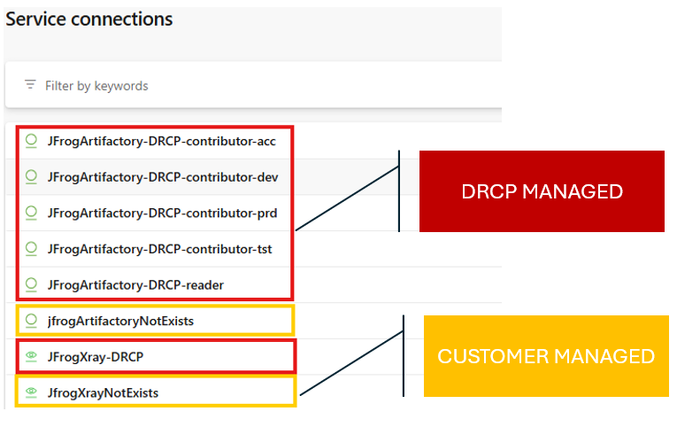

JFrog Artifactory and Xray
==========================

DRCP provides automated integration with the **JFrog Platform**, including **Artifactory** and **Xray**.  
For more details about the JFrog platform, see: `JFrog Platform <https://confluence.office01.internalcorp.net:8453/display/DEVSUP/JFrog+Platform>`__.

Overview
--------

DRCP simplifies the setup and management of service connections to JFrog.  
These service connections include tokens that are:

- **Automatically managed by DRCP** (created, renewed, and revoked).
- **Linked to the correct usage in JFrog Artifactory** (dev, tst, acc, prod).

If a JFrog Artifactory project doesn't exist for the Application system, DRCP will **automatically create the project** before configuring service connections.

Provisioned Service Connections
-------------------------------

DRCP creates and manages the following **Azure DevOps service connections**::

    JfrogArtifactory-DRCP-contributor-dev
    JfrogArtifactory-DRCP-contributor-tst
    JfrogArtifactory-DRCP-contributor-acc
    JfrogArtifactory-DRCP-contributor-prd
    JfrogArtifactory-DRCP-reader
    JfrogXray-DRCP

These connections allow your pipelines to interact with JFrog without manual configuration.

Important:
~~~~~~~~~~

- Service connections **created manually by the customer aren't managed by DRCP**.
- Service connections **created manually by DRCP aren't updated automatically**.
- Tokens used in DRCP-managed service connections **aren't visible in Azure DevOps**.  
  The **service connection name indicates the token type and its permissions** (for example, `contributor` or `reader`).

Token Permissions
-----------------

- **Reader**  
  Provides **read-only access** to all repositories in the project.  
  Use this for pipelines that download artifacts.

- **Contributor**  
  Provides **read and write access** to repositories in the specified usage (dev, tst, acc, prod).  
  Use this for pipelines that publish artifacts.

- **Xray Token**  
  Grants access to **JFrog Xray** for security and compliance scans.  
  Use this for pipelines that check dependencies for vulnerabilities.

Notes
-----

- Existing Azure DevOps service connections not created by DRCP remain unchanged.
- Artifactory defines the environments: dev, tst, acc, and prod.
- Tokens are valid for **one month** and expire automatically. Tokens revoke automatically in the JFrog Platform after they expire.

For more details about JFrog roles and environments, see: `JFrog Roles & Environments <https://confluence.office01.internalcorp.net:8453/display/DEVSUP/Jfrog+-+Managing+tokens/>`__.
