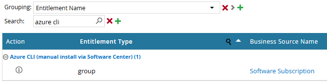

Azure CLI
=========

.. contents::
   Contents:
   :local:
   :depth: 2

Introduction
-------------
| This page provides guidance on how to use the `Azure CLI tool <https://learn.microsoft.com/en-us/cli/azure/>`__ together with the DRCP platform.

.. include:: ../../_static/include/tool-versiondisclaimer.txt

Azure CLI in Azure DevOps pipelines
-----------------------------------

| You don't need to retrieve the Azure CLI from Artifactory for Azure DevOps pipelines because the build agent image already includes it.
| `This page <https://learn.microsoft.com/en-us/azure/devops/cli/azure-devops-cli-in-yaml?view=azure-devops&tabs=bash>`__ on the Microsoft documentation website explains how you can use Azure CLI in your pipelines.

Azure CLI on the APG workstation
--------------------------------

For using Azure CLI on the client, request the package via `IAM tooling <https://iam.office01.internalcorp.net/aveksa>`__:

.. confluence_newline::

Known issues
------------

In certain scenarios, the following error occurs when trying to connect to Azure:

.. code-block:: powershell

  PS C:\Users\myuser> az login
  HTTPSConnectionPool(host='login.microsoftonline.com', port=443): Max retries exceeded with url: /organizations/v2.0/.well-known/openid-configuration (Caused by SSLError(SSLCertVerificationError(1, '[SSL: CERTIFICATE_VERIFY_FAILED] certificate verify failed: unable to get local issuer certificate (_ssl.c:1000)')))
  Certificate verification failed. This typically happens when using Azure CLI behind a proxy that intercepts traffic with a self-signed certificate. Please add this certificate to the trusted CA bundle. More info: https://learn.microsoft.com/cli/azure/use-cli-effectively#work-behind-a-proxy.

To resolve this issue, ensure the system variable ``REQUESTS_CA_BUNDLE`` points to a valid, non-expired CA bundle, such as ``C:\users\myusername\ca-bundle.crt``.

.. note:: JFrog Artifactory also makes use of the ``REQUESTS_CA_BUNDLE`` system variable. In case you retrieve packages from it, ensure that the variable points to a valid CA bundle belonging to the JFrog Artifactory source servers.