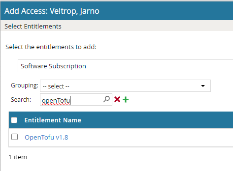

OpenTofu
========

.. contents::
   Contents:
   :local:
   :depth: 2

Introduction
-------------
| This page provides guidance on how to use the OpenTofu CLI tool together with the DRCP platform.
| The OpenTofu CLI provides a Terraform-compatible tool for managing infrastructure. See `OpenTofu CLI <https://opentofu.org/>`__.

.. include:: ../../_static/include/tool-versiondisclaimer.txt

OpenTofu CLI in Azure DevOps pipelines
--------------------------------------
| For using the OpenTofu CLI in Azure DevOps pipelines, download the OpenTofu CLI via JFrog Artifactory. Request a generic remote repository to `Releases - OpenTofu CLI <https://github.com/opentofu/opentofu/releases>`__ by sending a mail to CM-DevelopmentSupport.
| Add the following steps to an Azure DevOps pipeline to use the OpenTofu CLI:

.. code-block:: yaml

         - task: Bash@3
           displayName: 'Install internal trusted root certificate chain Linux and load OpenTofu CLI in JFrog'
           inputs:
             targetType: 'inline'
             script: |
               echo "Installing internal root certificates..."
               sudo curl -L -o /usr/local/share/ca-certificates/CA01-APG.crt http://prime03.office01.internalcorp.net/crt/CA01-APG.crt
               sudo curl -L -o /usr/local/share/ca-certificates/CA02-Azure.crt http://prime03.office01.internalcorp.net/crt/CA02-Azure.crt
               sudo curl -L -o /usr/local/share/ca-certificates/CA02-DC.crt http://prime03.office01.internalcorp.net/crt/CA02-DC.crt
               sudo curl -L -o /usr/local/share/ca-certificates/CA02-IRIS.crt http://prime03.office01.internalcorp.net/crt/CA02-IRIS.crt
               sudo update-ca-certificates

               curl -u <JFrog username>:<JFrog token> -O https://jfrog-platform.office01.internalcorp.net:8443/artifactory/<JFrog remote github repo>/opentofu/opentofu/releases/download/v1.8.6/tofu_1.8.6_linux_amd64.tar.gz

         - task: JFrogGenericArtifacts@1
           displayName: 'Download OpenTofu CLI from JFrog'
           inputs:
             command: 'Download'
             connection: 'Artifactory2'
             specSource: 'taskConfiguration'
             fileSpec: |
               {
                 "files": [
                   {
                     "pattern": "<JFrog remote github repo>/opentofu/opentofu/releases/download/v1.8.6/tofu_1.8.6_linux_amd64.tar.gz",
                     "explode": "true"
                   }
                 ]
               }
             failNoOp: true

         - task: AzureCLI@2
           displayName: 'Run OpenTofu for Terraform Operations'
           inputs:
             azureSubscription: <service connection>
             scriptType: pscore
             scriptLocation: inlineScript
             addSpnToEnvironment: true
             inlineScript: |
               try {
                 # Define the path to the tofu binary
                 $tofuPath = "$(Build.SourcesDirectory)/opentofu/opentofu/releases/download/v1.8.6/tofu"
        
                 # Ensure the binary is executable
                 Write-Output "Ensuring tofu binary is executable..."
                 chmod +x $tofuPath

                 # Navigate to the Terraform folder
                 cd "$(Build.SourcesDirectory)/terraform"
        
                 # Initialize Terraform/tofu
                 Write-Output "Initializing tofu..."
                 & $tofuPath init
        
                 # Validate configuration
                 Write-Output "Validating Terraform configuration..."
                 & $tofuPath validate
        
                 # Plan infrastructure changes
                 Write-Output "Planning infrastructure changes..."
                 & $tofuPath plan -out=tfplan
        
                 # Apply the planned changes
                 Write-Output "Applying Terraform configuration..."
                 & $tofuPath apply -auto-approve
        
                 # Show outputs
                 Write-Output "Displaying outputs..."
                 & $tofuPath output
               }
               catch {
                 throw "An error occurred during Terraform operations."
               }
               finally {
                 # Cleanup after test
                 Write-Output "Value of removeResourcesAfterTest: $(removeResourcesAfterTest)"
                 if ($(removeResourcesAfterTest) -eq $true) {
                   Write-Output "Destroying resources..."
                   & $tofuPath destroy -auto-approve
                 } else {
                   Write-Output "Skipping resource cleanup as per parameter setting."
                 }
               }

OpenTofu CLI on the APG workstation
-----------------------------------

For using OpenTofu CLI on the APG workstation, request the package via `IAM tooling <https://iam.office01.internalcorp.net/aveksa>`__:

.. confluence_newline::

