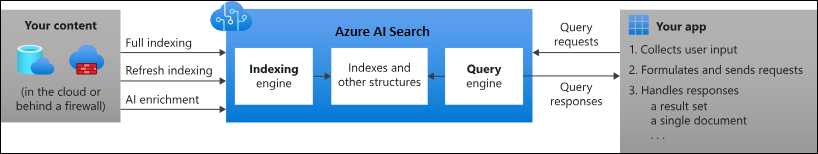

Use cases AI Search
===================

.. include:: ../../_static/include/component-usecasepage-header.txt

.. note:: Please note that the following AI services requires an approval for usage. Please contact the Product Owner DRCP.

AI Search
---------
Azure AI Search is a cloud-based search-as-a-service solution from Microsoft that provides search capabilities for applications. Azure AI Search is a scalable, enterprise-level search and retrieval system. Systems and users interact through APIs for vector, full-text, and hybrid search, leveraging advanced indexing, query, and relevance tuning, integrated with Azure's data, AI, and machine learning services.

Figure 1 - Reference architecture of the main functions provided by Azure AI Search and contextual relationships. `Source <https://learn.microsoft.com/en-us/azure/search/search-what-is-azure-search>`__

Use cases and follow-up
-----------------------

Client libraries
^^^^^^^^^^^^^^^^
| Azure AI Search offers `different client libraries <https://learn.microsoft.com/en-us/azure/search/search-get-started-text?tabs=dotnet/>`__, also called as Software Development Kits (SDK), for local development in some programming languages.
| DevOps teams can choose any language they prefer to interact with and develop against Azure OpenAI, based on the specific needs of their application and the team's preferences.
| Common languages for this purpose include Python, C#, or JavaScript, as they integrate well with Azure SDKs and APIs.

**Follow-up:**

| DevOps teams can choose any client libraries, but they must use Artifactory for storing and distributing software.
| Artifactory is mandatory on APG workstations and Azure DevOps pipelines because it ensures secure and reliable software distribution and usage.
| Artifactory helps manage dependencies and ensures integrity and trustworthiness.
| Note that if you plan to use the Python SDK, it's important to know that the `relevant <https://pypi.org/project/azure-search-documents/>`__ package is available via PyPI, by Artifactory.

Service tier
^^^^^^^^^^^^
The available service tiers are Free, Basic, Standard, High-density and Storage Optimized. `Learn more <https://learn.microsoft.com/en-us/azure/search/search-sku-tier>`__.
Each service tier imposes different limits on storage, workloads, and the number of indexes and other objects. It also differs on:

- Only the Standard and higher tiers includes Availability Zones capabilities.
- The Free tier lacks a Service Level Agreement (SLA) and doesn't support private endpoints.

**Follow up:**

DRCP provides DevOps teams the flexibility to choose a service tier that fits and advises to use the Standard of higher tiers for critical workloads.
DRCP also advises DevOps teams to understand the sizing needs from a Partition and Replica perspective and how they influence the Search units. `Learn more. <https://learn.microsoft.com/en-us/azure/search/search-capacity-planning>`__

Azure region support
^^^^^^^^^^^^^^^^^^^^
The Azure region Sweden Central is a major hub for Azure AI services and supports AI Search.
Sweden Central also supports Availability Zones and is the default region for APG DRCP deployments.

West Europe hosts the AI Search capability and is APG approved, but its older infrastructure has more constrained capacity compared to Sweden Central.
Therefor DRCP decided to just allow Sweden Central as an approved region.

**Follow-up:**

DevOps teams should deploy the component in Azure region Sweden Central, which is the default region for an environment. This makes sure that:

- Data isn't sent outside the default region.
- All functionality is available without expansion to other regions (except for the optional Semantic Ranker).
- DevOps teams can use the maximum capacity for the component, which is available in Sweden Central.

DevOps teams should be aware that:

- No regional redundancy of the service is available.
- Semantic Ranker isn't available in Sweden Central at the time of writing.
- A regional Azure outage can also impact the components availability.

Azure availability zones for production
^^^^^^^^^^^^^^^^^^^^^^^^^^^^^^^^^^^^^^^
Replicas are copies of your index and individual replicas are the units for availability zone assignment. `Learn more. <https://learn.microsoft.com/en-us/azure/reliability/reliability-ai-search>`__

An Azure AI Search instance by default contains at least one replica.
Adding replicas allows for machine reboots and maintenance against one replica, while query execution continues on other replicas.

The Microsoft SLA of at least 99.9% availability is just for configurations that meet these criteria:

- Two replicas for high availability of read-only workloads (queries).
- Three or more replicas for high availability of read-write workloads (queries and indexing).

**Follow-up:**

DRCP advises DevOps teams to deploy the service with replicas to use availability zones in a production environment.
This enables the Microsoft criteria for 99.9% availability SLA.
DevOps teams should be aware of the `costs <https://azure.microsoft.com/en-us/pricing/details/search/>`__ associated with more replicas and partitions.

Quota management
^^^^^^^^^^^^^^^^
For each vector field the component constructs an internal vector index.
Microsoft imposes quotas on vector index size, so it's crucial to estimate and track vector size to stay within the limits. `Learn more. <https://learn.microsoft.com/en-us/azure/search/vector-search-index-size>`__

**Follow up:**

DevOps teams can manage their quotas for cost control with flexibility and autonomy.
To stay within quota limits, they should estimate and track vector size. Actively tracking Subscription cost management reports ensures costs remain under control.

Shared private link for indexers
^^^^^^^^^^^^^^^^^^^^^^^^^^^^^^^^
Indexers may need to pull information from supported Azure services within an Azure virtual network. `Learn more. <https://learn.microsoft.com/en-us/azure/search/search-indexer-howto-access-private?tabs=portal-create#supported-resource-types>`__
APG requires this connection to be private and using a shared private link ensures this private connection. `Learn more. <https://learn.microsoft.com/en-us/azure/search/search-indexer-howto-access-private?tabs=cli-create>`__

The private endpoint connection needs approval on the Azure service and requires an explicit approval by the resource owner.
For instance when using Azure Storage and a private endpoint for Azure Storage already exists, a shared private link is also required, otherwise the storage side refuses the connection. `Learn more. <https://learn.microsoft.com/en-us/azure/search/search-indexer-howto-access-private?tabs=portal-create#supported-resource-types>`__

Please note that you need to approve programmatically the connection in production usages.
See `this <https://learn.microsoft.com/en-us/azure/search/search-indexer-howto-access-private?tabs=portal-create#2---approve-the-private-endpoint-connection>`__ page to see examples how to do that for instance at the Storage Account, CosmosDB or Azure OpenAI.

DRCP discovered that the body payload (in the PUT endpoint) for approving the private link between AI Search and Storage Account was different than Microsoft documented in the preceding URL.
Please use the following example as a reference:

.. code-block::

    {
      "properties": {
        "privateLinkServiceConnectionState": {
          "status": "Approved",
          "description": "Please approve"
        },
        "privateEndpoint": {
            "id": "/subscriptions/<Microsoft provided subscription id>/resourceGroups/<Microsoft provided resource group>/providers/Microsoft.Network/privateEndpoints/<your private endpoint>"
        }
      }
    }

Keep in mind that ``id`` in the preceding payload is the resource id of the shared private link that you create between AI Search and a data source.
DRCP doesn't recommend building resource id from strings, as knowing Microsoft provided Subscription id and resource group name ahead of time is impossible. Instead use the resource id obtained after the deployment of the shared private link.
Missing ``privateEndpoint`` section raises the cross-Subscription private link policy violation.

**Follow up:**

DevOps teams must deploy a shared private link when using the indexer feature to pull information from `supported data sources <https://learn.microsoft.com/en-us/azure/search/search-indexer-overview#supported-data-sources>`__.
DevOps teams need to grant explicit approval to the shared private link of the corresponding Azure service.

Data exfiltration options
^^^^^^^^^^^^^^^^^^^^^^^^^
This component offers three types of optional AI enrichment features:

- **Utility skills**: Process data within the component for enrichment.

- **Built-in skills**: Send data to other Azure AI Services for enrichment.

- **Custom skills**: Send data to any internal or external API for enrichment.

Built-in Skills: Provide access to Azure AI Services, including unauthorized service types, with up to 20 free transactions. Transactions beyond this limit require permissions to the Azure AI Services multi-service kind, which isn't allowed by DRCP.
Custom Skills: Send data to external APIs, but the component can't route outbound traffic over a VNet. This limitation may expose data to the internet.

**Follow up:**
To ensure data security and compliance with APG policies, customers must adhere to the following:

1. Use approved API versions.

Deployments must use one of the following API versions. DRCP disallows deployments using any other API versions:

- ``Microsoft.Search/searchServices@2024-03-01-preview``
- ``Microsoft.Search/searchServices@2021-04-01-preview``
- ``Microsoft.Search/searchServices@2024-06-01-preview``

2. Set the ``DisabledDataExfiltrationOptions`` property.

DevOps teams must set the DisabledDataExfiltrationOptions property to 'All'. This setting disables all enrichment features (utility, built-in, and custom skills) and prevents data exfiltration. Azure policy will block deployments that omit this property or use a value other than 'All'.

Authentication
^^^^^^^^^^^^^^^
Every secure request to the component must `authenticate <https://learn.microsoft.com/en-us/azure/search/search-security-overview#authentication>`__. By default, requests can authenticate with either Microsoft Entra ID credentials or by using key-based authentication.

**Follow up:**

DRCP requires `Microsoft Entra ID authentication <https://learn.microsoft.com/en-us/azure/search/keyless-connections?tabs=csharp%2Cazure-cli>`__ to achieve one centralized authentication method for every DevOps team.
Key-based authentication is a form of local authentication that's blocked by policy, based on the :doc:`security baseline drcp-srch-01 <Security-Baseline>`.

Authorization
^^^^^^^^^^^^^
The component supports Azure role-based access control (Azure RBAC), an authorization system for managing individual access to Azure resources. Using Azure RBAC, you assign different team members different levels of permissions based on their needs for a given project. `Learn more <https://learn.microsoft.com/en-us/azure/search/search-security-rbac?tabs=roles-portal-admin%2Croles-portal%2Croles-portal-query%2Ctest-portal%2Ccustom-role-portal>`__

**Follow up:**
AI Search provides built-in RBAC roles that DevOps teams can assign as needed. They can flexibly grant these roles and permissions themselves. For reading data, DRCP recommends the ``Search Index Data Reader`` role and DRCP recommends the Search Index Data Contributor role for uploading data to AI Search.

Document-level security
^^^^^^^^^^^^^^^^^^^^^^^
The component doesn't provide native document-level permission and can't vary search results from within the same index by user permissions. `Learn more. <https://learn.microsoft.com/en-us/azure/search/search-security-trimming-for-azure-search>`__

**Follow-up:**
DRCP advises DevOps teams to create a filter in the application layer that trims search results based on a string containing a group or user identity. `Learn more. <https://techcommunity.microsoft.com/blog/azure-ai-services-blog/access-control-in-generative-ai-applications-with-azure-ai-search/3956408>`__
This makes sure the access rights within the index and the source are equal and changes applied to the source are also applied to the index.

.. note:: Please be aware that the access rights within the index aren't automatically updated when the source access rights gets modified. The DevOps team is responsible to maintain document-level security in the index and in the source.

Encryption
^^^^^^^^^^
For data at rest, Microsoft uses Service-managed Keys to encrypt and decrypt data. It applies to content (indexes and synonym maps) and definitions (indexers, data sources, skill sets), on data disks and temporary disks.
Service-managed encryption is an internal Microsoft process that utilizes 256-bit AES encryption. This encryption applies automatically to all indexing operations.
Service-managed encryption covers all content in both long-term and short-term storage. `Learn more. <https://learn.microsoft.com/en-us/azure/search/search-security-overview#service-managed-keys>`__

Two possible encryption options are available: Microsoft-managed keys and customer-managed keys (CMK).

**Follow up:**

DRCP relies on Microsoft to manage the lifecycle of encryption keys for all components where this option is available.
DevOps teams must select Microsoft-managed keys instead of customer-managed keys. DRCP will revisit this when DHT updates the encryption guidelines.

Logging and monitoring
^^^^^^^^^^^^^^^^^^^^^^
Diverse logging and diagnostic settings are available. `Learn more. <https://learn.microsoft.com/en-us/azure/search/monitor-azure-cognitive-search#analyze-monitoring-data>`__
DRCP doesn't enforce logging on component level and allows DevOps teams to configure logging and diagnostics themselves since DevOps teams are accountable for their application service quality and maintenance.

**Follow-up:**
DRCP advises DevOps teams to use appropriate logging levels where it makes sense. Keep in mind that logging comes at a cost.

AI Language custom question answering
^^^^^^^^^^^^^^^^^^^^^^^^^^^^^^^^^^^^^
AI Language contains a feature called `custom question answering <https://learn.microsoft.com/en-us/azure/ai-services/language-service/question-answering/overview>`__ which leverages AI Search.
Microsoft authenticates this connection with keys, a form of local authentication that violates the security baseline of AI Search.
At moment of writing, you can't change how the connection is setup.
Hopefully, Microsoft will update this functionality in the future and offer Microsoft Entra ID as an alternative authentication method.
For now, DRCP mitigates the risk by making a technical change to the existing AI Search local authentication policy, by adding a tag. Until there is a solution to this limitation.

**Follow-up:**

- AI Search Local Authentication Disabled

Because of the connection limitation as mentioned, DRCP offers a workaround to establish the connection and use the functionality.
DevOps teams needs to apply a tag to the AI Search deployment. This way it's possible to be compliant with the AI Search local authentication policy.

How that looks like:

.. code-block::

    resource cognitiveService 'Microsoft.Search/searchServices@2024-06-01-preview' = {
      name: cognitiveServiceName
      location: location
      properties: {
        publicNetworkAccess: 'Disabled'
        disableLocalAuth: false
        disabledDataExfiltrationOptions: ['All']
      }
      sku: {
        name: 'standard'
      }
      tags: {
        usedBy: 'AILanguage'
      }
    }

- AI Search Service Connections Inbound

Because of Microsoft's bug, the policy can't recognize the Subscription id of the created private endpoint, which results in a not established connection.
This means when you enable the feature in AI Language, the connection that being setup under the hood won't complete.
To workaround until Microsoft fixes the issue, DRCP has changed the policy effect to **Disabled** and won't result in denied deployments.
