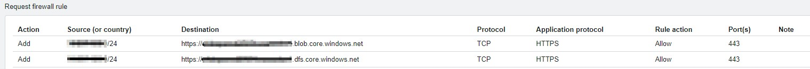
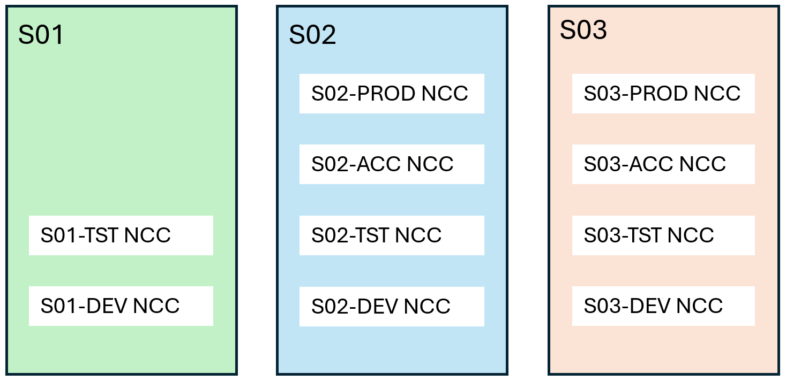

Use cases Databricks
====================

.. include:: ../../_static/include/component-usecasepage-header.txt

Purpose of this document
------------------------
| This document describes the infrastructure aspects of using the Azure Databricks component securely in DRCP.
| The :doc:`APG Security baseline for Databricks <Security-Baseline>` for the component provides security controls that every usage of the component must apply. This document provides information on implementing some of those controls and sets further expectations around secure and responsible usage.
| This component's users should also consider relevant best practices, including application design and implementation, lifecycle management, DevOps way of working, etc. This document references some of these best practices as a starting point.

Use cases
---------

| The Azure Databricks DRCP component doesn't provide all capabilities of the Azure Databricks service.
| It now supports following usage patterns:

1.	Data Engineering: batch processing of data stored in Azure Data Lake Gen2 on DRCP environments, using interactive notebooks and jobs

Not supported use cases
^^^^^^^^^^^^^^^^^^^^^^^
Other usage patterns, including the examples below aren't supported yet, so don't use them:

1. Data Engineering: using Unity Catalog external connections
2. SQL warehouses: queries, dashboards, alerts
3. Compute custom containers
4. Machine Learning and Mosaic AI
5. Serving AI models
6. Delta Sharing, as a provider
7. Marketplace, as a provider and as a consumer
8. Partner Connect that's not using Microsoft Entra ID

Please refer to the 'Cloud Competence Center' (CCC) in your business unit for further information.

Deploying Azure Databricks
--------------------------
Deploying and configuring Azure Databricks should use the environment's 'CI/CD' service principal from a 'CI/CD' pipeline of the Application system's Azure DevOps project.

Workspace
^^^^^^^^^
The term 'workspace' refers to three distinct concepts:

-	An Azure Databricks service, deployed in Azure and accessible as any Azure resource.
-	An environment provided because of Azure Databricks service deployment, accessible via a service portal.
-	A way to organize artifacts inside the environment.

The term catalog refers to two concepts:

-	Unity Catalog, an account-level collection of governance features, including user management, data storage connections, data lineage and more.
-	Data catalog, an object that stores metadata of data structures.

Prerequisites
^^^^^^^^^^^^^
| Azure Databricks service requires two subnets for its compute resources with the minimum size of /26 each, and one subnet to deploy a private endpoint.
| This means the Virtual Network itself should be of size /24.

Don't add any other Azure resources to the Subnets that Databricks compute resources use since it's a dedicated subnet for Databricks resources.

It's advisable to have separate routing tables and NSGs for worker subnets and private endpoint subnet. NSGs for Databricks workers should allow Outbound traffic limited to the services that Databricks compute needs to access.

Databricks Azure service
^^^^^^^^^^^^^^^^^^^^^^^^

.. note:: At this moment you can't deploy an Azure Databricks service via the Azure portal. You should use a Bicep template instead. For a sample bicep template please consult your BU Cloud Competence Center.

After deploying, the Azure Databricks service creates a Databricks workspace that requires further configuration before an engineering team can use it for development and application deployment.

Following the service deployment you would create a private endpoint to this Azure Databricks workspace. Configure the workspace to comply to the APG Security baseline for Databricks and this guidance.

Firewall rules
^^^^^^^^^^^^^^^^^^^^^^^^
Rules for every new workspace
~~~~~~~~~~~~~~~~~~~~~~~~~~~~~
| Databricks compute provisioning requires network access to the storage account (“DBFS Root”) that's automatically provisioned with each Azure deployment.
| Please request the following firewall rules with Enterprise Networks from the `Infrastructure Catalog <https://apgprd.service-now.com/now/nav/ui/classic/params/target/com.glideapp.servicecatalog_cat_item_view.do%3Fv%3D1%26sysparm_id%3D29f13edcdb8c3410b00a5bd05b961908%26sysparm_link_parent%3D8b450b7d4fd9a200eec9cda28110c758%26sysparm_catalog%3D0a334d003734ee003486f01643990e3b%26sysparm_catalog_view%3Dcatalog_infrastructure_catalog>`__.
| The source is the subnet of your Subscription and the destination is the storage account that resides in the ``...-adbmanaged-rg`` resource group with the 2 endpoints mentioned in the figure. All traffic is HTTPS TCP port 443.

.. confluence_newline::

Rules for resources outside your environment
~~~~~~~~~~~~~~~~~~~~~~~~~~~~~~~~~~~~~~~~~~~~
| The central firewall virtual appliance (NVA) by default restricts network access from Databricks compute to resources outside of the Application system environment.
| To access resources outside your Application system environment, request consent from the target Application system's owners and ask for a firewall rules change for your Application system.

Please also request firewall rules to JFrog Artifactory, if you plan to use packages for Databricks clusters.

Identity Federation
^^^^^^^^^^^^^^^^^^^
:doc:`APG Security baseline for Databricks <Security-Baseline>` requires that the Microsoft Entra ID group membership grants access to the workspace, not via an individual account assignment.
To meet this need, make sure to enable the workspace with Identity Federation (part of Unity Catalog) after the initial deployment. Please consult your BU CCC.

Databricks access connector
^^^^^^^^^^^^^^^^^^^^^^^^^^^
| Databricks access connector is an Azure resource used as part of Unity Catalog governance model to configure access to Azure resources with a managed identity.
| Please refer to this article on deploying and configuring an access connector: `Use Azure managed identities in Unity Catalog to access storage <https://learn.microsoft.com/en-us/azure/databricks/connect/unity-catalog/cloud-storage/azure-managed-identities#create-connector>`__.

Configuring access to Databricks workspaces
-------------------------------------------
After the initial deployment of the Azure Databricks service, the access controls list of the Databricks workspace is empty.

During the process of enabling the Identity Federation for the workspace, the Databricks account administrators will assign workspace administrator privileges to a 'CI/CD' service principal of the Application system. And to Engineers IAM role in Development usage.

.. warning:: Before configuring the workspace, please make sure it's enabled with Identity Federation.

A workspace administrator needs to take further actions to configure the workspace according to the :doc:`APG Security baseline for Databricks <Security-Baseline>` and instructions in this document.

Using Databricks CLI
^^^^^^^^^^^^^^^^^^^^

.. note:: DISCLAIMER: This document provides configuration examples using Databricks CLI for illustration purposes. Some examples are using APIs that are still in 'preview' at the time of writing. Don't use the code in these examples 'as-is' since it requires adjustments to situation and testing.

For configuring Databricks workspace and its objects use the :doc:`Databricks CLI <../../Application-development/Tools/DatabricksCLI>`.

You need to prepare the local environment for using the Databricks CLI by creating configuration profiles that uses `Azure CLI for authentication <https://learn.microsoft.com/en-us/azure/databricks/dev-tools/cli/authentication>`__.

Example (Databricks CLI):

.. code-block:: powershell

	az login
	databricks configure --host https://xxx.yyy.azuredatabricks.net
	databricks auth profiles --host xxx.yyy.azuredatabricks.net

( Replace ``xxx.yyy`` with the values from the Databricks workspace URL that you can find in the Azure Databricks service resource properties. )

See this documentation for `available CLI commands <https://github.com/databricks/cli>`__.

.. _Use-cases-Databricks-Service-Principals-label:

Service principals
^^^^^^^^^^^^^^^^^^

You should use at least two service principals in each Databricks workspace deployment. One 'CI/CD' service principal - to create the workspace itself from the 'CI/CD' pipeline and to have it in a Workspace Administrator role. And another one ('Objects Owner') service principal - as the Owner of compute and other workspace objects and have a Workspace User role.

This way the clusters, when they execute jobs, won't be able to use the elevated permissions of the 'CI/CD' service principal.

You may need more service principals for specific tasks, like owning Unity Catalog objects, accessing Azure resources, but these two are the minimum.

DRCP provides 'CI/CD' service principal as part of environment provisioning. You should use the standard process of requesting other service principals from the ServiceNow service catalog.

.. _Use-cases-Databricks-CI/CD-Service-Principal-label:

Continuous Integration / Continuous Delivery service principal
~~~~~~~~~~~~~~~~~~~~~~~~~~~~~~~~~~~~~~~~~~~~~~~~~~~~~~~~~~~~~~
Users of Azure Databricks must use 'CI/CD' principals and pipelines to deploy and configure Databricks workspaces, per :doc:`APG security baseline <Security-Baseline>`. In the 'Development' environment, this is highly recommended but not mandatory. If you deploy the workspace with a personal user account in a 'Development' environment, reconfigure it as the default administrator post-deployment. Without this, you can't create the Data catalog.

.. vale Microsoft.SentenceLength = NO

The reconfiguration includes making the 'CI/CD' service principal the Workspace Administrator. 'CI/CD' service principal is the application registration in Microsoft Entra ID used for authenticating service connections from the Azure DevOps project of a DRCP Application system, and the display name is 'SP-App-<ApplicationSystemName>-<EnvironmentName>-ADO-001'.

The workspace administrator can add the service principal to the workspace using the Databricks CLI, Databricks API, or the Databricks workspace UI.

.. vale Microsoft.SentenceLength = YES

Example (Databricks CLI):

.. code-block:: powershell

	databricks service-principals create --application-id <ApplicationID> --display-name <ApplicationRegistrationName>
	databricks service-principals list --filter "displayName eq <ApplicationRegistrationName>"
	databricks api put "https://xxx.yy.azuredatabricks.net/api/2.0/preview/permissionassignments/principals/<ServicePrincipalID>" --json '{ \"permissions\": [ \"ADMIN\" ] }'

(ApplicationRegistrationName and ApplicationID are the name and the ID of the application registration in Microsoft Entra ID. The ServicePrincipalID is the Databricks-internal ID for the registration on the service principal in your Databricks account.)

An existing workspace administrator can assign a service principal, already present in the Databricks account, to the workspace-internal system group named 'admins' to grant it a workspace administrator role.

Example (Databricks CLI):

.. code-block:: powershell

	databricks groups list --filter "displayName eq admins"
	databricks service-principals list  --filter "displayName eq <ApplicationRegistrationName>"
	databricks groups patch <AdminsGroupID> --json '{ \"schemas\": [ \"urn:ietf:params:scim:api:messages:2.0:PatchOp\" ], \"Operations\": [ { \"op\": \"add\", \"path\": \"members\", \"value\": [ { \"$ref\":\"ServicePrincipals/<ID>\", \"value\":\"<ID>\" } ] } ] }'
	databricks groups get <AdminsGroupID>

Objects Owner service principal
~~~~~~~~~~~~~~~~~~~~~~~~~~~~~~~

The environment's 'CI/CD' service principal shouldn't own workspace objects, such as catalogs, connections, clusters, jobs, notebooks, queries, etc.

Create a separate Azure service principal for this purpose ('Objects Owner' service principal) and register it with the workspace in the User role. Use this service principal as the owner of objects.

Please refer to this article :doc:`App registrations <../../Platform/Microsoft-Entra-ID/App-registrations>` for information on how to create a service principal in a 'CI/CD' pipeline.

Create a separate Microsoft Entra ID service principal for this purpose and register it as the Databricks workspace user.

.. _Use-cases-Databricks-Users-and-Groups-label:

Users and Groups
^^^^^^^^^^^^^^^^
.. warning:: Azure portal provides a “Launch Workspace” link on an Overview page of the Azure Databricks resource. Don't use this link to access the workspace. Instead, enable the workspace with the Identity Federation and use the Databricks workspace URL that you can find in the Azure Databricks service resource properties.

According to the :doc:`APG Security baseline for Databricks <Security-Baseline>`, the Microsoft Entra ID **group membership** grants access to the Databricks workspace, and not an individual account assignment. Two ways to stay compliant with this need exist:

-	use a 'CI/CD' pipeline with a pre-configured Service Principal to deploy the Azure Databricks service, and configure a Databricks workspace with Microsoft Entra ID groups that need to have access to it;
-	in case of a deployment by an individual account, transfer the workspace administrator role to a Microsoft Entra ID group or a service principal:

   - make sure to enable Identity Federation.
   - add the 'CI/CD' service principal into the workspace and grant it a Workspace Administrator role. See 'Adding a service principal to a workspace'.
   - add a Microsoft Entra ID group into workspace Administrator role. See 'Adding user groups to a workspace' section below.
   - remove the individual accounts from the Administrator role of the workspace.
   - remove the individual accounts from the workspace.

Adding Microsoft Entra ID user groups to a workspace
~~~~~~~~~~~~~~~~~~~~~~~~~~~~~~~~~~~~~~~~~~~~~~~~~~~~
In general, Databricks workspaces allow creating new user groups or adding existing ones. Groups created in a workspace refers to 'workspace-local' groups, and they aren't managed by a Microsoft Entra ID. Two special system local groups 'users' and 'admins' exist, that come with every workspace by default and you can't remove them.

According to the :doc:`APG Security baseline for Databricks <Security-Baseline>`, it's **not allowed to create and use workspace-local groups** (except for system ones). To manage access to a workspace and its objects you must use Microsoft Entra ID groups.

To assign a Microsoft Entra ID group to a Databricks workspace, the group must exist at the account level and the workspace must have Identity Federation enabled. See Identity Federation documentation.

A workspace administrator can add the available Microsoft Entra ID group into the workspace using the workspace portal's ``Admin Settings`` section, the Databricks CLI, or the Databricks API.

Example (Databricks CLI):

-  Find the internal identifier for a group with <searchWord> in the name:

.. code-block:: powershell

   databricks api get "https://xxx.yy.azuredatabricks.net/api/2.0/account/scim/v2/Groups?filter=displayName%20co%20<searchWord>"

-  Assign the group to the workspace:

.. code-block:: powershell

	databricks api put "https://xxx.yy.azuredatabricks.net/api/2.0/preview/permissionassignments/principals/<GroupID>" --json '{ \"permissions\": [ \"USER\" ] }'

-  Check the results:

.. code-block:: powershell

	databricks api get "https://xxx.yy.azuredatabricks.net/api/2.0/preview/permissionassignments"

A workspace administrator can grant the Microsoft Entra ID group the Workspace Administrator role by adding it to the 'admins' system group via CLI or API. Do this either during or after workspace addition (use ``ADMIN`` instead of ``USER``).

Example (Databricks CLI):

-  Find the identifier for the internal 'admins' group and a second identifier for the group that gets the Administrators role:

.. code-block:: powershell

   databricks groups list --filter "displayName eq admins"
   databricks groups list --filter "displayName eq <GroupName>"

-  Use these two identifiers in a patch operation on an ``admin`` group:

.. code-block:: powershell

	databricks groups patch <AdminsGroupID> --json '{ \"schemas\": [ \"urn:ietf:params:scim:api:messages:2.0:PatchOp\" ], \"Operations\": [ { \"op\": \"add\", \"path\": \"members\", \"value\": [ { \"$ref\":\"Groups/<GroupID>\", \"display\":\"<GroupName>\", \"value\":\"<GroupID>\" } ] } ] }'

Removing users from the Workspace Administrator role
~~~~~~~~~~~~~~~~~~~~~~~~~~~~~~~~~~~~~~~~~~~~~~~~~~~~

Individual accounts shouldn't be in the Workspace Administrator role and remove them in one of two ways: using the workspace portal or programmatically.

.. warning:: ATTENTION. Be careful with this operation as improper use may lock you out of Administration capabilities. Ensure you have added a service principal to the 'admins' group before proceeding.

In the portal, go to the workspace settings > Identity and Access > Groups > 'admins' group > Members, and remove the assignment.

Example (Databricks CLI):

.. code-block:: powershell

   databricks groups patch <AdminsGroupID> --json '{ \"schemas\": [ \"urn:ietf:params:scim:api:messages:2.0:PatchOp\" ], \"Operations\": [ { \"op\": \"remove\", \"path\": \"members[$ref eq \\\"Users/<UserID>\\\"]\" } ] }'

Removing users from the workspace
~~~~~~~~~~~~~~~~~~~~~~~~~~~~~~~~~
Manage access to the workspace via a Microsoft Entra ID group participation. When you added users directly (or the Account Administrator or the Azure provisioning process), please remove them from a direct assignment.

Check which users have direct access in the portal or using the Databricks CLI and find their IDs.

Example (Databricks CLI):

.. code-block:: powershell

	databricks users list

Use a service principal with a Databricks CLI to remove direct assignment of user account from the workspace users. Or you can ask your other colleagues in workspace administrator role to do it in the workspace portal.

Example (Databricks CLI):

.. code-block:: powershell

	databricks api delete "https://xxx.yy.azuredatabricks.net/api/2.0/preview/permissionassignments/principals/<UserID>"

.. _Use-cases-Databricks-Configuring-label:

Configuring Databricks workspace
--------------------------------
A secure and compliant configuration of a Databricks workspaces includes configuring workspace settings, cluster policies, and init scripts.

Workspace settings
^^^^^^^^^^^^^^^^^^
These are the required settings for any workspace:

.. list-table::
   :widths: 40 40 40
   :header-rows: 1

   *  - Setting
      - Value
      - Description
   *  - Groups / Group / Entitlements, Allow unrestricted cluster creation
      - Off
      - Except for 'admins' group, as you can't disable it.
   *  - Users / User, Unrestricted cluster creation
      - Off
      -
   *  - **Security**
      -
      -
   *  - Table access control
      - On
      - Enables access control on object stored in Hive metastore (legacy)
   *  - MLflow run artifact download
      - Off
      - Allowed to be On in Development
   *  - Upload data using the UI
      - Off
      - Allowed to be On in Development
   *  - Store interactive notebook results in customer account
      - On
      -
   *  - **Compute**
      -
      -
   *  - SQL warehouses, Data Access Configuration
      - Empty, No service principals
      -
   *  - SQL warehouses, SQL Configuration Parameters
      - Empty
      -
   *  - Global init scripts, list of scripts
      - Empty
      -
   *  - Web terminal
      - Off
      - Allowed to be On temporarily in Development for troubleshooting cluster errors
   *  - Enforce user isolation
      - On
      -
   *  - **Development**
      -
      -
   *  - Git URL allow list permission
      - Restrict Clone, Commit & Push to allowed Git repositories
      -
   *  - Git URL allow list
      - Empty
      - Can be https://connectdrcpapg1@dev.azure.com/connectdrcpapg1/yourProject/ in usage Development
   *  - Allow repos to export IPython Notebook (IPYNB) output
      - Disabled
      -
   *  - **Notifications**
      -
      -
   *  - Notifications destinations *
      - Empty
      -
   *  - Notifications Email (all options) *
      - Off
      -
   *  - **Advanced**
      -
      -
   *  - Workspace access for Azure Databricks personnel
      - Not enabled
      - Only temporary allowed when Azure personnel needs access in case of an incident
   *  - Personal Access Tokens
      - Not enabled
      -
   *  - Init scripts stored on DBFS
      - Permanently disable
      -
   *  - Default catalog for the workspace
      - UnityCatalog-enabled catalog that you create
      -
   *  - DBFS File Browser
      - Not enabled
      - Allowed to enable in Development
   *  - Databricks ``Autologging``
      - Not enabled
      -
   *  - Legacy MLflow Model Serving
      - Not enabled
      -
   *  - Verbose Audit Logs
      - Not enabled
      - Allowed to temporarily enable in Development for troubleshooting errors
   *  - FileStore Endpoint
      - Not enabled
      -
   *  - Any other setting in 'Other' category
      - Not enabled
      -

Settings by workspace users
^^^^^^^^^^^^^^^^^^^^^^^^^^^
Each Databricks workspace user should configure the Azure Repositories connection to use Microsoft Entra ID.

User settings > User > Linked accounts > Git integration > Git provider: Azure DevOps Services (Microsoft Entra ID). Follow this `link <https://learn.microsoft.com/en-us/azure/databricks/repos/get-access-tokens-from-git-provider>`__ for more information.

.. _Use-cases-Databricks-Cluster-policies:

Cluster policies
^^^^^^^^^^^^^^^^
Workspace administrators should configure custom compute policies that will enforce the needs and best practices in this document. There can be more than one policy tailored to specific usage types.
This is the list of allowed family policies:

-	Shared compute
-	Job compute
-	Personal compute (Development usage)

Shared compute
~~~~~~~~~~~~~~
The policy for Shared Compute should have these required settings:

.. code-block:: powershell

   {
      "data_security_mode": {
            "type": "fixed",
            "value": "USER_ISOLATION",
            "hidden": true
      }
   }

The cluster-type should be 'all-purpose' for batches and 'dlt' for ``Lakeflow Spark Declarative Pipelines`` pipelines:

.. code-block:: powershell

   {
      "cluster_type": {
            "type": "fixed",
            "value": "all-purpose"
      }
   }

Recommended settings:

.. code-block:: powershell

   {
      "node_type_id": {
            "type": "allowlist",
            "values": [
            "Standard_DS3_v2",
            "Standard_DS4_v2",
            "Standard_DS5_v2"
            ],
            "defaultValue": "Standard_DS3_v2"
      },
      "spark_version": {
            "type": "fixed",
            "value": "auto:latest"
      },
      "driver_instance_pool_id": {
            "type": "forbidden",
            "hidden": true
      },
      "instance_pool_id": {
            "type": "forbidden",
            "hidden": true
      },
      "autotermination_minutes": {
            "isOptional": false,
            "minValue": 15,
            "maxValue": 120,
            "type": "range",
            "defaultValue": 30
      }
   }

Jobs compute
~~~~~~~~~~~~
The cluster-type should be 'job' for batches and 'dlt' for ``Lakeflow Spark Declarative Pipelines`` pipelines:

.. code-block:: powershell

   {
      "cluster_type": {
         "type": "fixed",
         "value": "job"
      }
   }

Recommended settings:

.. code-block:: powershell

   {
      "spark_conf.spark.databricks.cluster.profile": {
         "type": "forbidden",
         "hidden": true
      },
      "spark_version": {
         "type": "unlimited",
         "defaultValue": "auto:latest-lts"
      },
      "node_type_id": {
         "type": "unlimited",
         "defaultValue": "Standard_DS3_v2",
         "isOptional": true
      },
      "num_workers": {
         "type": "unlimited",
         "defaultValue": 4,
         "isOptional": true
      },
      "azure_attributes.availability": {
         "type": "unlimited",
         "defaultValue": "SPOT_WITH_FALLBACK_AZURE"
      },
      "azure_attributes.spot_bid_max_price": {
         "type": "fixed",
         "value": 100,
         "hidden": true
      },
      "instance_pool_id": {
         "type": "forbidden",
         "hidden": true
      },
      "driver_instance_pool_id": {
         "type": "forbidden",
         "hidden": true
      }
   }

Personal compute
~~~~~~~~~~~~~~~~
The policy for personal Compute should have these required settings:

.. code-block:: powershell

   {
      "data_security_mode": {
            "type": "fixed",
            "value": "SINGLE_USER",
            "hidden": true
      }
   }

The cluster-type should be 'all-purpose' for batches and 'dlt' for ``Lakeflow Spark Declarative Pipelines`` pipelines:

.. code-block:: powershell

   {
      "cluster_type": {
         "type": "fixed",
         "value": "all-purpose"
      }
   }

Recommended settings:

.. code-block:: powershell

   {
      "node_type_id": {
         "type": "allowlist",
         "values": [
            "Standard_DS3_v2",
            "Standard_DS4_v2",
            "Standard_DS5_v2"
         ],
         "defaultValue": "Standard_DS3_v2"
      },
      "spark_version": {
         "type": "unlimited",
         "defaultValue": "auto:latest-ml"
      },
      "runtime_engine": {
         "type": "fixed",
         "value": "STANDARD",
         "hidden": true
      },
      "num_workers": {
         "type": "fixed",
         "value": 0,
         "hidden": true
      },
      "driver_instance_pool_id": {
         "type": "forbidden",
         "hidden": true
      },
      "instance_pool_id": {
         "type": "forbidden",
         "hidden": true
      },
      "azure_attributes.availability": {
         "type": "fixed",
         "value": "ON_DEMAND_AZURE",
         "hidden": true
      },
      "spark_conf.spark.databricks.cluster.profile": {
         "type": "fixed",
         "value": "singleNode",
         "hidden": true
      },
      "autotermination_minutes": {
         "isOptional": false,
         "minValue": 15,
         "maxValue": 120,
         "type": "range",
         "defaultValue": 30
      }
   }

Libraries
^^^^^^^^^
When configuring clusters, source the libraries either from the source control system (Azure DevOps Repository). Or from the package repositories in the centrally managed corporate artifact storage solution (JFrog Artifactory). Don't download Artifacts from public repositories because it violates the APG security standards.

Please refer to your BU CCC for help in integrating your Databricks deployment with package repositories.

Init scripts
^^^^^^^^^^^^
Don't use DBFS to store init scripts. Refer to this guide: `What are init scripts? <https://learn.microsoft.com/en-us/azure/databricks/init-scripts/#migrate>`__

Refer to article `Compute compatibility with libraries and init scripts <https://learn.microsoft.com/en-us/azure/databricks/compute/compatibility>`__ for information on compatible options.

For shared compute clusters you can't use your own scripts, but you can use the init scripts that the platform provides in the 'allowed list'. These tested init scripts include APG specific configurations such as certificates and configuration of package repositories.
Please refer to the 'Cloud Competence Center' (CCC) in your business unit for further information.

Workspace objects access management
-----------------------------------
Designing and implementing access management on objects in a Databricks workspace is a responsibility of the Workspace Administrator role. This includes compute, data, and code.

Creating compute in Databricks workspaces
-----------------------------------------
Create Databricks clusters based on a compute policy that the workspace administrator creates, and assigns to (groups of) users for usage. See Cluster policies section for more information.

Serverless
^^^^^^^^^^
The Azure Databricks APG component supports the use of serverless compute for SQL warehouse and for general compute.

Please be aware that the use of serverless compute has limitations, see `Serverless compute limitations <https://learn.microsoft.com/en-us/azure/databricks/compute/serverless/limitations>`__ .

Register workspaces in NCC
~~~~~~~~~~~~~~~~~~~~~~~~~~
Databricks uses Network Connectivity Configurations (NCC) to manage serverless network connectivity.
The Databricks account at APG contains NCC's per region, per business unit, per usage.

Databricks has a limit of 10 NCC's, every business unit gets 4 NCC's, one per usage. This means that workspaces can't access data from other business units or other usages.
Before using serverless, Databricks workspace administrators must make sure to register the workspace in the right NCC. Please consult your BU CCC.

.. note:: ``In the near future``, APG will provide an API for registering workspaces in the Databricks account. This includes enabling Identity Federation and registering the workspace in the NCC.

Register endpoint rules
~~~~~~~~~~~~~~~~~~~~~~~
APG uses private endpoints to connect to Azure resources. To create a private endpoint for Databricks serverless the workspace administrator needs to manage two actions:

1. Create a private endpoint rule in the NCC of the workspace. ``Create a request in ServiceNow with the business unit, the usage, the resource id of the data resource, and the resource type of the data resource.``
2. The owner of the Azure resource needs to approve the private endpoint on the resource. See `approve new private endpoints <https://learn.microsoft.com/en-us/azure/databricks/security/network/serverless-network-security/serverless-private-link#approve-private-endpoints>`__ .

.. note:: In the future, APG will provide an API for registering private endpoints in a NCC.

Shared compute
^^^^^^^^^^^^^^
When creating compute, Databricks workspace administrators must:

-	Not allow creating clusters with ``No Isolation Shared``.
-	When using Shared compute clusters, teams need to use the init scripts that the BU CCCs provide. These tested init scripts include APG specific configurations such as certificates and package repositories.
-	Ensure local disk encryption, if cluster node types contain disks.
-	Not use DBFS Root as a source of init scripts for the cluster.
-	Not configure cluster logs to sent to DBFS Root.
-	Not use Databricks versions earlier than ``13.3 LTS``.
-	Not use custom containers.
-	Make 'Objects owner' service principal the owner of the cluster.

Databricks workspace administrators and users should:

-	Choose the size mindfully, considering the cost implications.
-	Use the latest LTS version of the runtime available.
-	Configure the ``Terminate after`` setting to no larger than 120 minutes.

Refer to the `Best practices: Cluster configuration <https://learn.microsoft.com/en-us/azure/databricks/compute/cluster-config-best-practices>`__ article for more information, including on considerations for choosing the right cluster sizing.

It's recommended to use cluster tags to track costs per cluster or a set of clusters. These tags report to Azure cost analysis on the Azure Subscription.

Personal compute
^^^^^^^^^^^^^^^^
Using ``Personal compute`` cluster type is solely allowed in development environment type. All the needs from the previous section about the Shared Compute clusters also apply to Personal Compute clusters.

SQL warehouses
^^^^^^^^^^^^^^
Every new workspace comes with a default configuration of ``Starter Warehouse`` cluster. The owner of the Starter warehouse is the identity that initiated the deployment of Azure Databricks service. If this identity doesn't have workspace administrator privileges, the cluster won't be able to start. In this case, create a new warehouse cluster under a workspace administrator identity, and assign workspace users a privilege to use it.

When creating a new SQL warehouse compute cluster, Databricks workspace users and administrators should:

-	Use either “Pro” or “Classic” family of clusters.
-	Start with a small `cluster size <https://learn.microsoft.com/en-us/azure/databricks/compute/sql-warehouse/warehouse-behavior>`__ and limited scaling and optimize the size based on balance between queries latency and costs.
-	Not use service principles to access other DRCP resource, but use Unity Catalog features instead.
-	Make 'Objects owner' service principal the owner of the cluster.

When configuring the access to clusters, it's important to keep in mind that owners and users with 'manage' permission can view all queries executed on the cluster.

Refer to this article for considerations on sizing the SQL warehouse cluster: `SQL warehouse sizing, scaling, and queuing behavior <https://learn.microsoft.com/en-us/azure/databricks/compute/sql-warehouse/warehouse-behavior>`__.

Jobs
^^^^
Configure job clusters as part of creating a job, and they're provisioned during a job. Use a cluster policy that the workspace administrator configures, to configure job clusters.

Use of general-purpose personal compute clusters for running jobs is available in Development environment types, but not recommended.

Workspace administrators should make 'Objects owner' service principal the owner of the job.

Pipelines
^^^^^^^^^
When creating a new pipeline, Databricks workspace users and administrators should make 'Objects owner' service principal the owner of the pipeline.

Using disk on clusters
^^^^^^^^^^^^^^^^^^^^^^
Cluster disks are ephemeral. Don't store data on cluster disks.

Azure resource quotas
^^^^^^^^^^^^^^^^^^^^^
Every Azure Subscription comes with a default maximum allowance of ``CPUs`` across Subscription resources. This limit in DRCP is now 350 per CPU family type which will be not be a bottleneck.

.. _Use-cases-Databricks-Creating-data-catalog:

Creating a data catalog
-----------------------
A catalog that's created using Unity Catalog features (UC catalog) is a recommended way of managing access to data, both internal to the workspace and external. DRCP doesn't support Hive Metastore.

The steps to create such catalog are:

1.	Create external credential.
2.	Create an external location.
3.	Create a catalog.
4. Configure access restrictions on the catalog, schemas, and schema objects.

External credentials
^^^^^^^^^^^^^^^^^^^^
To register a managed identity for use in accessing Azure resources, a Databricks Access Connector resource in Azure must exist. And the 'Contributor' role granted on the connector resource to the identity that creates an external location. Use the 'CI/CD' principal to create and own the external credential.

A workspace must use the access connector from the same Subscription.
This article provides help on understanding the process of creating an external credential: `Create a storage credential <https://learn.microsoft.com/en-us/azure/databricks/connect/unity-catalog/cloud-storage/external-locations>`__

External locations
^^^^^^^^^^^^^^^^^^
An external location is a Databrick-managed connection to the Azure Data Lake Gen2 that's using the external credential (managed identity). It eliminates the need for using service principals and managing the lifecycle of secrets.

Databricks workspace users should use Unity Catalog external locations in their code, and shouldn't connect to DRCP Azure resources directly in code using service principals.

The workspace administrator ('CI/CD' service principal) must own the external locations. Other users of the workspace must not have access to manage it. Users of other Databricks workspaces must not have access to the external location.

Please refer to this article for further information on creating an external location: `Create an external location <https://learn.microsoft.com/en-us/azure/databricks/connect/unity-catalog/cloud-storage/storage-credentials>`__.

Catalog
^^^^^^^
A Databricks workspace should have a Unity Catalog (data) catalog to manage connections to its data storage in Azure.

When creating a catalog, a workspace administrator specifies the external location. After the creation the workspace administrator must also configure access restrictions on this catalog to allow it for use by one or more specific workspace. Sharing the catalog with all workspaces isn't allowed.

The 'Data owner' service principal must own the catalog and objects within it (volumes, tables, etc.). Other identities from the workspace must not have access to manage it, unless in the Development environment.

Users of other Databricks workspaces must not have access to the catalog and its objects, unless you have specifically designed for this. Please consult with your BU CCC.

Volumes
^^^^^^^
To access the data stored in Azure Data Lake Gen2 via a UC-enabled catalog, you can create an external volume in the catalog. Read more about it in this article: `Create and work with volumes <https://learn.microsoft.com/en-us/azure/databricks/connect/unity-catalog/volumes>`__.

Using a data catalog
^^^^^^^^^^^^^^^^^^^^
To access the data in a UC catalog by users, use the following steps:

1. The owner of the catalog makes it available to another Databricks workspace.
2. The owner of the catalog authorizes the users of that workspace to access the catalog, its schemas and schema objects (tables or volumes), using Microsoft Entra ID groups and service principals.
3. Administrators request to open firewall ports between the Databricks workspace and the Azure Data Lake Gen2 storage account that holds the schema objects.

Creating objects in Databricks workspace
----------------------------------------
Unless specified differently, an 'Objects Owner' service principal should own all shared objects in a Databricks workspace, including those types listed below.

Repositories
^^^^^^^^^^^^
Please see this article on setting up Azure git folders for Databricks workspaces: `Set up Databricks git folders <https://learn.microsoft.com/en-us/azure/databricks/repos/repos-setup>`__.

Make 'CI/CD' service principal the owner of this object.

Notebooks
^^^^^^^^^
In the Development environment it's recommended to use the built-in git integration to store Databricks notebooks and Python files. In other environments use a 'CI/CD' pipeline and available tooling to deploy the artifacts from the source control into a workspace.

Job definitions
^^^^^^^^^^^^^^^
Design the job ownership and access sharing with care.

When sharing a job definition with other Databricks workspace identities and assigning them with permissions other than View. By default the job runs on behalf of its owner identity, so these other identities might get unauthorized access to the data.

Hive Metastore
^^^^^^^^^^^^^^
Store data in Unity Catalog instead of the outdated Hive Metastore. If you must use Hive Metastore, apply table access control.

DBFS
^^^^
Workspaces must not mount external storage into DBFS. Such mounts are accessible by all workspace users.

Instead, workspace administrators should configure storage connections using Unity Catalog. See Creating a catalog.

DBFS Root
^^^^^^^^^
Data stored in the DBFS Root is accessible to all users of the workspace. Workspaces must not store data in the DBFS root, and should use Unity Catalog catalogs instead.

Please read this article on the difference between DBFS and DBFS Root: `What's the Databricks File System (DBFS) <https://learn.microsoft.com/en-us/azure/databricks/dbfs/>`__.

To deploy a data application, consider using `'asset bundles' <https://learn.microsoft.com/en-us/azure/databricks/dev-tools/bundles/>`__ feature of Databricks CLI in combination with Azure CLI pipeline action.

Using secrets in Databricks
---------------------------
In general, you would store secrets in Databricks workspace in secret scopes, backed either by an Azure KeyVault or by an encrypted database owned and managed by Databricks (company). At the moment of writing the Azure Databricks doesn't support the RBAC-based permissions model, which is the single available option in the DRCP Azure KeyVault component.

The available option for storing secrets is to use the Databricks-backed secret scopes via Secrets API or Databricks CLI. Make sure to configure secret access control.

.. warning:: ATTENTION. Users with access to a secret can retrieve its value.

Best practices
--------------
Please refer to this article on best practices `Best practice articles - Azure Databricks | Microsoft Learn <https://learn.microsoft.com/en-us/azure/databricks/getting-started/best-practices>`__.

Also consider these articles:

-	`Security guide - Azure Databricks | Microsoft Learn <https://learn.microsoft.com/en-us/azure/databricks/security>`__
-	`Data governance guide - Azure Databricks | Microsoft Learn <https://learn.microsoft.com/en-us/azure/databricks/data-governance/>`__
-	`Configure diagnostic log delivery - Azure Databricks | Microsoft Learn <https://learn.microsoft.com/en-us/azure/databricks/administration-guide/account-settings/audit-log-delivery>`__
