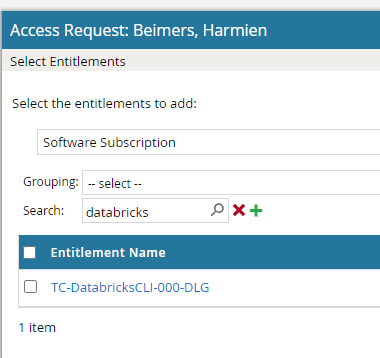

Use cases Azure Monitor
=======================

.. include:: ../../_static/include/component-usecasepage-header.txt

This page contains sections, one per feature of Azure Monitor:

- Generic Azure Monitor capabilities.
- Log Analytics Workspace.
- Application Insights.
- Azure Managed Grafana.

Generic Azure Monitor capabilities
----------------------------------

DRCP provides a pre-configured Azure Monitor Action Group that DevOps-teams can use to send alerts to ServiceNow through a webhook.

Also, `alerting through emails <https://learn.microsoft.com/en-us/azure/azure-monitor/alerts/action-groups#create-an-action-group-in-the-azure-portal>`__ is possible. Please note, that security baseline control ``drcp-amo-01`` restricts the emailrecipients to APG-owned domains.

See article :doc:`Custom Alerts Rules <../../Platform/Alerts-and-incidents/Custom-Alerts>` on how to leverage this capability.

Log Analytics Workspace
-----------------------

Agent keys
~~~~~~~~~~
`Log Analytics Agents <https://learn.microsoft.com/en-us/azure/azure-monitor/agents/log-analytics-agent>`__ , capable of processing Log Analytics data, is on a deprecation path.

With this agent feature also comes agent keys which pose a security risk to the confidentiality of the log data.
DRCP disabled the RBAC roles ``Monitoring Contributor`` and ``Automation Contributor`` which provide permissions to access these agent keys.

DRCP has replaced the RBAC role with a new DRCP custom role. This role named ``APG Custom - DRCP - Monitoring Contributor (FP-MG)`` performs similar functions without the capability of listing and regenerating these agent keys.

Data Export
~~~~~~~~~~~
`Data Export <https://learn.microsoft.com/en-us/azure/azure-monitor/logs/logs-data-export?tabs=portal>`__ in a Log Analytics workspace lets users continuously export data per selected tables in their workspaces.

Users can export to an Azure Storage Account or Azure Event Hubs as the data arrives to an Azure Monitor pipeline.

DRCP limited this feature due to security concerns about the confidentiality of exported data. DRCP allows exporting data from a Log Analytics Workspace to an Azure Storage Account within the same Subscription. Exporting data to a Storage Account in a different Subscription or to an Event Hub isn't permitted.

Linked Storage Accounts
~~~~~~~~~~~~~~~~~~~~~~~
Azure Monitor Logs relies on Azure Storage in scenarios.

Azure Monitor typically manages the storage automatically, but some cases require users to provide and manage their own `storage account <https://learn.microsoft.com/en-us/azure/azure-monitor/logs/private-storage>`__, also known as a customer-managed storage account.

Like the preceding use case. DRCP disabled this feature due to security concerns towards confidentiality of exported data.

Workspace-context access mode
~~~~~~~~~~~~~~~~~~~~~~~~~~~~~
Workspace-context access grants visibility to all logs within a single workspace. In contrast, resource-context access limits visibility to logs from resources that the identity can read.

Using resource-context offers more granularity and the possibility of log access (emphasis on cross-applicationsystem logging) inclusion in IAM onboardings, whilst avoiding implicit access at the same time.

Application Insights
--------------------

Authentication
~~~~~~~~~~~~~~
Application Insights supports `Microsoft Entra ID authentication <https://learn.microsoft.com/en-us/azure/azure-monitor/app/azure-ad-authentication?tabs=net>`__. By using Microsoft Entra ID, users can ensure that AD authenticated telemetry is send into Application Insights resources.

Telemetry data requires authentication by using managed identities and Microsoft Entra ID can be send to Application Insights.

Specific scenarios may require local authentication methods, for example public sources that send telemetry data to Application Insights. DevOps teams can except from control ``drcp-appi-01`` by applying Azure tag ``usedBy`` with value ``PublicSource``.

.. warning:: Use this tag for its intended purpose. Using it otherwise isn't allowed.

Log Analytics Workspace based storage
~~~~~~~~~~~~~~~~~~~~~~~~~~~~~~~~~~~~~
With workspace-based resources, `Application Insights sends telemetry to a common Log Analytics workspace <https://learn.microsoft.com/en-us/azure/azure-monitor/app/create-workspace-resource>`__. It provides full access to all the features of Log Analytics while keeping your application, infrastructure, and platform logs in a single consolidated location.

This integration allows for common Azure role-based access control across your resources and eliminates the need for cross-app/workspace queries.

This means that Classic Workspaces for Application Insights is unavailable.

WebTests
~~~~~~~~
Application Insights' `WebTest functionality <https://learn.microsoft.com/en-us/azure/azure-monitor/app/availability-overview>`__ sends web requests to your application at regular intervals from points around the world. It can alert you if a users application isn't responding or responds slow.

Disabled the automated tests within Application Insights due to Test Automation offering this.

Diagnostic settings
~~~~~~~~~~~~~~~~~~~
Users can use `Diagnostic Settings <https://learn.microsoft.com/en-us/azure/azure-monitor/essentials/diagnostic-settings?tabs=portal>`__ to export resource log and metric data to a destination.

Platform metrics will sent automatically to Azure Monitor Metrics by default and without configuration.

Platform logs provide detailed diagnostic and auditing information for Azure resources and the Azure platform, these diagnostic settings depend on:

- Resource logs which aren't collected until they're routed to a destination.

- Activity logs which exist on their own but have the capability to route to other locations.

Javascript Source Map Blob Storage URL
~~~~~~~~~~~~~~~~~~~~~~~~~~~~~~~~~~~~~~
`Source map <https://learn.microsoft.com/en-us/azure/azure-monitor/app/javascript-sdk-configuration#source-map>`__ support helps users debug minified JavaScript code with the ability to unminify the minified call stack of your exception telemetry.

- Compatible with all current integrations on the Exception Details panel

- Supports all current and future JavaScript SDKs, including Node JS, without the need for an SDK upgrade

Networking
~~~~~~~~~~
For components that are private on the network make sure that the route table that belongs to the originating subnet contains a route. That route instructs traffic tagged with the service tag ``AzureMonitor`` to point to the internet. For example, an App Service Environment.

Azure Managed Grafana
---------------------

.. note:: Azure Managed Grafana on DRCP is in beta-phase. Use case documentation is under construction until MVP.

The following guidelines apply to deployments of Azure Managed Grafana:

- Use the latest version of Grafana (at this moment version 12).
- Disable public network access, and use private endpoints. You don't need to provision private DNS, as its handled by the DRCP policies by automation.
- Disable service accounts, and use Microsoft Entra ID authentication (activate Managed Identity).
- Disable SMTP settings, as Azure Monitor provides features for alerting.
- The Azure portal deployment wizard provides options to assign RBAC roles (see screenshot below). Please clear these checkboxes, as assigning RBAC roles to user identities isn't allowed by policy, and restricts to allowed Microsoft Entra ID groups or the Azure DevOps Environment deployment principal. For more information, see page :doc:`Roles and authorizations <../../Getting-started/Roles-and-authorizations>`.

.. confluence_newline::

