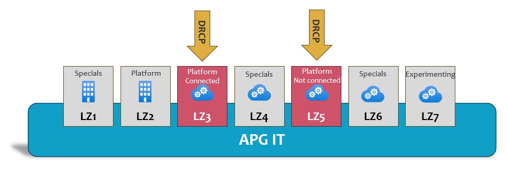

Frequently Asked Questions
==========================

.. contents::
   Contents:
   :local:
   :depth: 2

Purpose
-------

| Need help? This page answers frequently asked questions related to DRCP.
| Are you missing any information, please contact your BU CCC (Business Unit Cloud Competence Center).

.. vale Microsoft.HeadingPunctuation = NO

Questions
---------

Why do you need the DRDC portal for DRCP?
^^^^^^^^^^^^^^^^^^^^^^^^^^^^^^^^^^^^^^^^^
| DRCP integrates with the existing `DRDC <https://confluence.office01.internalcorp.net:8453/display/DRDCKB/DRDC+knowledge+base>`__ portal which was already available within APG for Landing zone 2.
| In the future, the name and/or location of this portal might change.

What's an 'Application system' and how does it relate to a DevOps team?
^^^^^^^^^^^^^^^^^^^^^^^^^^^^^^^^^^^^^^^^^^^^^^^^^^^^^^^^^^^^^^^^^^^^^^^
| An Application system is a collection of functionalities that's considered as a whole.
| A DevOps team can be responsible for 1 or more of these Application systems, so the relation between these two isn't necessarily 1:1.
| :doc:`This page <Getting-started/Application-System-and-Environments>` explains the definition of an Application system in detail.

How to define a name for the Application system?
^^^^^^^^^^^^^^^^^^^^^^^^^^^^^^^^^^^^^^^^^^^^^^^^
| It can be challenging to define a proper and valid name for a new Application system. :doc:`This page <Getting-started/Application-System-and-Environments>` explains the needs for the Application system name.
| Also, please consult the CCC of your business unit for help.

Is it possible to use existing Application systems in Landing zone 2 (DRDC) with DRCP?
^^^^^^^^^^^^^^^^^^^^^^^^^^^^^^^^^^^^^^^^^^^^^^^^^^^^^^^^^^^^^^^^^^^^^^^^^^^^^^^^^^^^^^
| You aren't allowed to reuse existing Application systems onboarded in Landing zone 2 (DRDC) for other Landing zones, because they're pinned to a single Landing zone.
| The organization reviews cross-Landing zone integration and DRCP shares updates as new information emerges.

What does it mean that DRCP covers Landing Zones 3 and 5?
^^^^^^^^^^^^^^^^^^^^^^^^^^^^^^^^^^^^^^^^^^^^^^^^^^^^^^^^^
| The terminology table on :doc:`this page <Getting-started/Definitions-and-abbreviations>` contains a detailed explanation about the APG term 'Landing zone'.
| DRCP hosts Landing zones 3 and 5, while other products hosts the remaining Landing zones and cover other functionalities, such as on-premises services.
| The Azure LLDC team, which is also part of Shared IT Services, manages the remaining Azure Landing zones (4, 6 and 7).

.. confluence_newline::

.. confluence_newline::

Are there any standards or best practices on how to name Azure resources?
^^^^^^^^^^^^^^^^^^^^^^^^^^^^^^^^^^^^^^^^^^^^^^^^^^^^^^^^^^^^^^^^^^^^^^^^^
| DRCP recommends to use the naming conventions as mentioned on :doc:`this <Getting-started/Naming-conventions>` page.
| Well-defined names and tags can help to find Azure resources quick, plus they provide insights into cloud usage across business units and enable efficient automation through infra-as-code.
| Please follow the BU-CCC standards as outlined on the `Getting Started` guides of the corresponding Business Unit.
| For Asset Management: `Using the DRCP <https://confluence.office01.internalcorp.net:8453/spaces/ACC/pages/202212223/Using+the+DRCP>`__ and for FB/DWS: `Getting Started <https://confluence.office01.internalcorp.net:8453/spaces/FBDWSCCCKB/pages/297241832/Getting+Started>`__.

How to arrange DNS for private endpoints?
^^^^^^^^^^^^^^^^^^^^^^^^^^^^^^^^^^^^^^^^^
| APG requires private network usage for Azure components.
| DRCP automates DNS zone group configurations on private endpoints using remediation policies.
| For all DRCP components that supports private endpoints, please leave the DNS zone configuration empty when creating a private endpoint. The DNS policy automation of the corresponding component remediates to the correct DNS zone configuration as soon as possible without any user intervention.

.. note:: This applies to Azure LZ3 Application systems. Other Landing zones exclude from this guideline.

How to request DNS records for other components, such as application gateway?
^^^^^^^^^^^^^^^^^^^^^^^^^^^^^^^^^^^^^^^^^^^^^^^^^^^^^^^^^^^^^^^^^^^^^^^^^^^^^
DRCP recommends to use the private DNS zone ``azurebase.net`` as DNS domain for registering applications.
You can use :doc:`this API <Platform/DRCP-API/Endpoint-for-dns-assignment>` to register DNS records (A and CNAME).

How to request an external signed SSL certificate?
^^^^^^^^^^^^^^^^^^^^^^^^^^^^^^^^^^^^^^^^^^^^^^^^^^
Request external signed SSL certificates (signed by Digicert) via the `Infrastructure Catalog <https://apgprd.service-now.com/now/nav/ui/classic/params/target/catalog_home.do%3Fsysparm_catalog%3D0a334d003734ee003486f01643990e3b%26sysparm_catalog_view%3Dcatalog_infrastructure_catalog>`__ > `Security Services <https://apgprd.service-now.com/now/nav/ui/classic/params/target/com.glideapp.servicecatalog_category_view.do%3Fv%3D1%26sysparm_parent%3D8b450b7d4fd9a200eec9cda28110c758%26sysparm_catalog%3D0a334d003734ee003486f01643990e3b%26sysparm_catalog_view%3Dcatalog_infrastructure_catalog>`__ > **APG PKI External Certificate** request form in ServiceNow.

.. note:: Specific groups of people within APG (grouped as "key-users") can access this request form. If the **APG PKI External Certificate** option isn't available, please contact your manager.

For more information, see page :doc:`Request external certificate <Application-development/Certificates/Request-external-certificate>`.

How to request firewall rules?
^^^^^^^^^^^^^^^^^^^^^^^^^^^^^^
| If you need firewall rules to manage traffic to or from your applications, request them in the firewall rules `form <https://apgprd.service-now.com/now/nav/ui/classic/params/target/com.glideapp.servicecatalog_cat_item_view.do%3Fv%3D1%26sysparm_id%3D29f13edcdb8c3410b00a5bd05b961908%26sysparm_link_parent%3D8b450b7d4fd9a200eec9cda28110c758%26sysparm_catalog%3D0a334d003734ee003486f01643990e3b%26sysparm_catalog_view%3Dcatalog_infrastructure_catalog%26sysparm_view%3Dtext_search>`__ in the infrastructure catalog in ServiceNow.
| Please consult an APG security consultant upfront for advice.

How to manage Azure costs and keep it under control?
^^^^^^^^^^^^^^^^^^^^^^^^^^^^^^^^^^^^^^^^^^^^^^^^^^^^
| When using Azure you need to actively track costs, to prevent unforeseen increases and keep you cloud usage costs under control.
| Azure Cost Management can help by providing cost analysis and alerting.
| One recommendation is to look at the cost analysis periodically and make changes if this helps to avoid unnecessary costs.
| Also set alerts to receive reminders as soon as your budget exceeds. Optimize costs by applying rightsizing SKUs, plans and consider automation to autoscale components whenever possible.

Learn more about Cost Management `here <https://azure.microsoft.com/en-us/products/cost-management>`__.

When to expect changes in the platform?
^^^^^^^^^^^^^^^^^^^^^^^^^^^^^^^^^^^^^^^
| DRCP releases every 2 weeks at the end of the sprint of team Azure Ignite. Read :doc:`this <Processes/Release-and-maintenance>` page to understand DRCP's release process.
| The latest release of DRCP doesn't necessarily apply to your Environment instant after the release.. It adheres to the scheduled maintenance run, or manual invoked refresh. See :doc:`this page <Processes/Release-and-maintenance>` for more information.
| DRCP summarize all changes in release notes, which you can find :doc:`here <Release-notes>`. One suggestion is to look periodically to know what changes are coming in the next release.

How to request a feature (such as a new Azure resource type) for the platform?
^^^^^^^^^^^^^^^^^^^^^^^^^^^^^^^^^^^^^^^^^^^^^^^^^^^^^^^^^^^^^^^^^^^^^^^^^^^^^^
Please let your product owner contact the BU CCC to discuss and determine priorities.

The platform blocks resource deployments while its type is in scope of a DRCP component. How to solve this?
^^^^^^^^^^^^^^^^^^^^^^^^^^^^^^^^^^^^^^^^^^^^^^^^^^^^^^^^^^^^^^^^^^^^^^^^^^^^^^^^^^^^^^^^^^^^^^^^^^^^^^^^^^^
| By default, DRCP doesn't enable all components for every Application system.
| The (DHT approved) design of each Application system defines the allowed components.
| To enable components, please use the :doc:`Quick action <Platform/DRDC-portal/Quick-actions>` 'Enable resource provider' on the Application system in the DRDC portal.

When's the requested Azure service available?
^^^^^^^^^^^^^^^^^^^^^^^^^^^^^^^^^^^^^^^^^^^^^
| If the DRCP product owner approved the request, the PO prioritizes the requested Azure services for a certain PI. After prioritization, DRCP investigates and develops the service as a component in Beta phase towards MVP.
| Read this :doc:`page <Processes/Building-block-phases>` to get an understanding of the DRCP's phases and what it entails.

How does a team get access to Azure or Azure DevOps?
^^^^^^^^^^^^^^^^^^^^^^^^^^^^^^^^^^^^^^^^^^^^^^^^^^^^
| Please contact the BU CCC who will guide DevOps teams with onboarding to Azure. If you need a playground, an experimental environment to discover the potential and (im)possibilities of Azure, DRCP recommends requesting an environment in Landing zone 7.
| Read this :doc:`page <Getting-started>` to know in dept what's needed to get started. Want to request a new experimental environment? Click `here <acc@apg.nl>`__.

How to cancel an Azure Subscription?
^^^^^^^^^^^^^^^^^^^^^^^^^^^^^^^^^^^^
| When an Azure Subscription isn't needed anymore, the DevOps team needs to remove the corresponding Environment through the DRDC portal. Make sure to first remove all Azure resources except the ones deployed by DRCP upfront. When you're ready, go to your Environment in the DRDC portal and remove the Environment. DRCP automation removes all remaining resources and configurations that belong to the Environment, such as the virtual network, policies, app registrations and the Azure Subscription.
| Find out :doc:`here <Platform/DRDC-portal/Quick-actions>` how to request the Environment removal.

.. note:: It's impossible to cancel the Azure Subscription yourself due to DRCP restrictions. Please use the DRDC portal to remove your Environment.

How to grant access for colleagues outside the team?
^^^^^^^^^^^^^^^^^^^^^^^^^^^^^^^^^^^^^^^^^^^^^^^^^^^^
| If it's incidental based, grant the colleague temporary access to the Application system or Environment. How this process works or how to get this done, please read this :doc:`page <Getting-started/Roles-and-authorizations>`. If the purpose is to grant access for a longer period, request access through IAM. Ask the product owner of your team to approve the colleague to the technical roles that belongs to the Application system or Environment.
| Read this :doc:`page <Getting-started/Roles-and-authorizations>` to get to know more about the roles and how to recognize them.
| Also, check the `IAM SharePoint site <https://cloudapg.sharepoint.com/sites/IAM-APG-EN>`__ to learn more about IAM within APG.

How long does it take for an Environment/Subscription to create?
^^^^^^^^^^^^^^^^^^^^^^^^^^^^^^^^^^^^^^^^^^^^^^^^^^^^^^^^^^^^^^^^
| The creation of a new Environment takes about 15 to 20 minutes to complete.
| Refreshing an existing Environment takes a similar amount of time. This delay causes by actions executed in sequence, such as creating the Azure Subscription, setting up the guardrails and configuring the network. Other potential delays could occur after creation in the visibility in the Azure portal (and RBAC access) due to IAM delays (for new Environments).

What security measures are in place and how to see its compliance state?
^^^^^^^^^^^^^^^^^^^^^^^^^^^^^^^^^^^^^^^^^^^^^^^^^^^^^^^^^^^^^^^^^^^^^^^^
| DRCP applies security measures, also known as guardrails, which applies to Azure DevOps and Azure. Go to the page :doc:`Azure components <Azure-components>` to find out which guardrails are applicable for components.
| The actual compliance state is visible through the `Policies dashboard <https://learn.microsoft.com/en-us/azure/governance/policy/how-to/get-compliance-data#portal>`__ in the Azure Portal.
| If compliance issues occurs, the DevOps team gets an incident assigned in ServiceNow.

What are the actual values of the input parameters of the DRCP Azure policies?
^^^^^^^^^^^^^^^^^^^^^^^^^^^^^^^^^^^^^^^^^^^^^^^^^^^^^^^^^^^^^^^^^^^^^^^^^^^^^^
| DRCP grouped the policies into a single policy set (initiative), which makes finding the actual input parameter values cumbersome.
| To find the values, go to the Azure portal, navigate to your Subscription, and go to menu item **Policies**. Click ``APG DRCP Policy``, then click **View assignment**, then click **View initiative**, and as final click **Duplicate definition**.
| Tab **Policy Parameters** displays the actual input parameter values.

What's the way forward when there are issues with the platform?
^^^^^^^^^^^^^^^^^^^^^^^^^^^^^^^^^^^^^^^^^^^^^^^^^^^^^^^^^^^^^^^
| If something isn't working due to errors or other unexpected platform behavior, please follow the instructions from :doc:`this page <Need-help>`.
| If you need support using Azure or have other generic Azure related questions, please contact the BU CCC of your business unit.

Is it allowed to use own (custom) Azure policies?
^^^^^^^^^^^^^^^^^^^^^^^^^^^^^^^^^^^^^^^^^^^^^^^^^
| At the moment of writing, the platform doesn't support configuring custom policies due to potential conflicts with the DRCP policies and its automation.
| DRCP will review this automation in the future. If you have feedback for improving the DRCP policies, please contact your BU CCC.
| If you discovered a bug or other issue with the DRCP policies, please raise an incident through the ServiceNow portal through the instruction on :doc:`this page <Need-help>`.

How to change the VNet address space of an Environment Subscription?
^^^^^^^^^^^^^^^^^^^^^^^^^^^^^^^^^^^^^^^^^^^^^^^^^^^^^^^^^^^^^^^^^^^^
| You can not change the address range that belongs to the Environment Subscription because it's managed by the platform automation.
| If you require more space, you can add address spaces through Quick action **Add VNet address space**. See page :doc:`Quick actions <Platform/DRDC-portal/Quick-actions>` for more information.

Is it allowed to use new AI features in Azure components?
^^^^^^^^^^^^^^^^^^^^^^^^^^^^^^^^^^^^^^^^^^^^^^^^^^^^^^^^^
| Microsoft adds new AI features to Azure components all the time.
| DRCP doesn't allow using these new AI features in Azure components, because APG guidelines forbid the use of AI without formal permission.
| DRCP has to investigate every new AI feature before use. Please contact your BU CCC for advice in case you need to use a new AI feature.

How does DRCP align its platform with the continuous changes and additions in Azure?
^^^^^^^^^^^^^^^^^^^^^^^^^^^^^^^^^^^^^^^^^^^^^^^^^^^^^^^^^^^^^^^^^^^^^^^^^^^^^^^^^^^^
| To keep the platform up-to-date, DRCP maintains and follows a specific Life Cycle Management (LCM) process each Program Increment (PI) to review Microsoft's component updates.
| On each component page (subpages of :doc:`Azure components <Azure-components>`) you will find a changelog.

How to activate an eligible privileged roles?
^^^^^^^^^^^^^^^^^^^^^^^^^^^^^^^^^^^^^^^^^^^^^^^
| Because privileged roles have no permissions to Environment with usage Production, you'll need to activate your role first.
| To find your eligible privileged roles got to the Azure portal and select the `Privileged Identity Management <https://portal.azure.com/#view/Microsoft_Azure_PIMCommon/ActivationMenuBlade/~/aadgroup>`__
| :doc:`Roles and authorizations <Getting-started/Roles-and-authorizations>` shows an overview of your eligible privileged roles.

.. vale Microsoft.HeadingPunctuation = NO

Others
------
| Didn't find what you were looking for? Or having a different question related to Azure Cloud or the DRCP platform unanswered? Please contact the BU CCC of your business unit.
