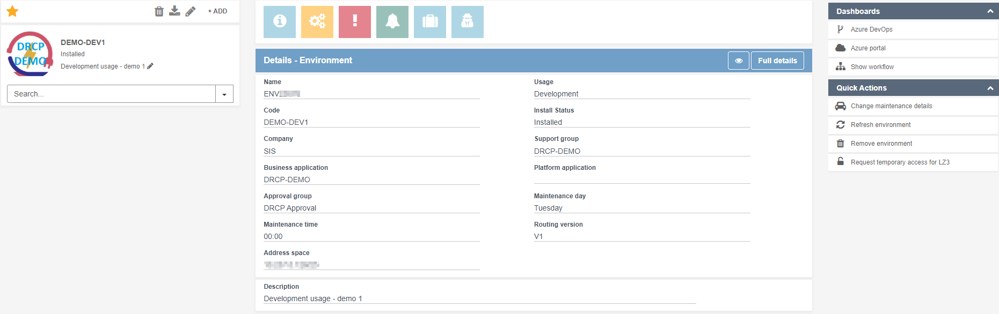

Application system and Environments
=====================================

.. contents::
   Contents:
   :local:
   :depth: 2

This article explains what Application systems and Environments are and provides information on how to request, manage, and remove an :doc:`Environment <Definitions-and-abbreviations>`.

Application system
-----------------------
An Application system is a collection of functionalities that's considered as a whole. When referred, it's the name of the Application/service that's created by the business DevOps team. An Application system may contain zero, one, or more Environments, with each Environment dedicated to a selected usage. The :doc:`definitions page <Definitions-and-abbreviations>` shows the full definition of an Application system.

The DevOps team can't create an Application system themselves. To get a new Application system send a request to the BU CCC. When requesting an Application system provide them with the following information:
 * Preferred name of the Application system. A valid name has 2 to 16 characters, only includes letters, numbers, and dashes (-), and has to start with a letter.
 * Product owner of the Application system.
 * Description of the application.
 * Optional: group email address for the DevOps team.

.. note:: For every new Application system the team has to follow the :doc:`onboarding process <Onboarding-process>`. The CCC will set the priority (in collaboration with the DevOps team) of creating and onboarding new Application systems.

When setting up a new Application system it may be difficult to determine what's included in one Application system and when it's better to split the Application system. The following standards and guidelines should provide some guidance.

.. list-table::
   :widths: 20 20 60
   :header-rows: 1

   * - Category
     - Type
     - Description
   * - Permissions
     - Standard
     - Application systems have standard defined permissions. If DevOps permissions have to differ within an Application system, create a separate Application system.
   * - Ownership
     - Standard
     - An Application system has one owner. If there is more then one owner, it should be a different Application systems.
   * - Independence
     - Standard
     - If part of an Application system can't run without another part (or need a jointly LCM procedure) then these belong to the same Application system.
   * - User perception
     - Guideline
     - If users of an Application system don't consider it as a whole, but as different parts, it's logical to define more Application systems.
   * - Production usage
     - Guideline
     - If more then one production usage Environment is necessary, it may be good practice to create more Application systems. A logical explanation could be that there are more (separated) customers, more business units or a shadow-production Environment. In particular for smaller systems, one Application system is often expected.
   * - Service portfolio management
     - Guideline
     - In the service portfolio management approach, incidents, problems and other aspects link to single Application system. If more details are desirable, an option is to create separate Application systems. A business capability (term from service portfolio management) can consist of more than one Application systems.
   * - Costs and resource usage insights
     - Guideline
     - Insights in resource usage and limiting resource spend, is setup for one Environment belonging to a single Application system. If this should be different, create more Application systems.
   * - Relations
     - Guideline
     - In case separate functional parts, together support a single functionality and have a strong cohesion, consider this to be one Application system.
   * - Deployments
     - Guideline
     - Execute deployments for an entire Application system. If parts frequently aren't included in the same release, it's advised to create a separate Application system for these parts.
   * - DevOps team
     - Guideline
     - It's possible for a DevOps team to manage more than one Application system. It's never a reason to consider everything managed by one DevOps team as one Application system.

Environment
---------------------
A DRCP Environment consists of an Azure Subscription in which the DevOps team can manage the full lifecycle of an instance of an application. For example, one development instance will always be one Environment. If more development instances are necessary it's possible to create more Environments with that usage. An Environment determines the generic boundary for Azure components. This includes the VNet provided for connectivity, authorizations for the DevOps team and the APG guardrails that are in place. Within DRCP, the Environment has a 1:1 relation to a Subscription.

The :doc:`definitions page <Definitions-and-abbreviations>` shows the full definition of an Environment.

Request an Environment
^^^^^^^^^^^^^^^^^^^^^^^^^

Execute the steps below to request an Environment:

* Go to the **Dashboard** of the `DRDC portal <https://apgprd.service-now.com/drdc>`__.
* Click the **+Add** button and wait for the form to load.
* Provide the requested information:

  * **Requested for**: change this value when requesting the Environment for someone else.
  * Which **Approval group** should approve requests for this Environment.
  * Which **Application system** to create the Environment for.
  * Choose a different **Change date** to schedule the creation of this Environment at a later time.
  * Provide a **Code** for the Environment. The code is a human-friendly identifier for the Environment throughout the IRIS platform (DRDC, DRDP, DRCP and ICE).The code is unique per Application system (not unique for APG) and may contain max 30 characters. The allowed characters are numbers, upper and lower case letters, underscores (_) and dashes (-). The code must end with a letter or number.
  * Select the **Usage** of the Environment. The available options are *Development*, *Test*, *Acceptance* and *Production*. Note that not all usages are always available for every Application system. To request access to other usages use the Quick action :doc:`Set allowed usage <../Platform/DRDC-portal/Quick-actions>`.
  * Fill in a **Description** of the Environment and its intended use. This is visible in the Environment overview page.
  * Select a **VNet Size** required for the Environment. Make sure to not overuse addresses.
  * Select a **Maintenance day** and **Maintenance time** required for the Environment. For more information on the maintenance process click :doc:`here <../Processes/Release-and-maintenance>`.
  * **Accept the disclaimer**, indicating that the requester understands that this request will influence either SVU, DVU, GB, and the administration of configuration items in the CMDB. And that the requester consulted with the responsible service team or its service delivery manager, before ordering this request.
  * (Optionally) **Add attachments** to this request for more information about this request.

    .. note:: Attachments attach to the *request*, not the Environment itself.

* Click *Submit*.

.. hint:: Searchable fields (Application system, Approval group) will match from the beginning of the line. To search for the occurrence of the search string anywhere, start the search with an asterisk (*).

.. warning:: The CMDB of ServiceNow determines the name of the Azure Subscription (for example ``OURAS-ENV12345-ACC``, where ``ENV12345`` serves as the Environment identifier within Application system ``OURAS``.). It's impossible to change this name.

.. warning:: The IAM provisioning is an asynchronous process, triggered by creation, refreshment, or removal of an Environment or Application system. Depending on the current IAM queue length, it's possible that there is a delay in the access to the Environment's Subscription.

Overview of an Environment
^^^^^^^^^^^^^^^^^^^^^^^^^^

When selecting an Environment, the screen shows 3 blocks.

|image0|

The Environment and configuration items overview
""""""""""""""""""""""""""""""""""""""""""""""""

Displayed on the left of the page are the specifications of the selected Environment or component. These are the *icon*, *code* of the Environment or *name* of the component, *status*, and *description*.

The *status* indicates wether the Environment or component is ready to use. The most common statuses are:

* Installed: Environment is ready to use.
* Pending install: creation of the Environment is still in progress.
* In maintenance: Environment is under maintenance. See the **Changes** tab for the active, scheduled, and closed changes.
* Removed: the Environment is no longer usable.

* Clicking the *star*, adds the Environment to the favorite list.

* Clicking the *pencil*, allows changing the icon of the Environment.

Below the Environment information, there is a list of all CIs which are active in this Environment. Use the search bar to filter the
list. The CI list is part of an Landing zone 2 or hybrid Application systems and will be empty for Landing zone 3 Environments.

Detailed information of the Environment and the infrastructure components
"""""""""""""""""""""""""""""""""""""""""""""""""""""""""""""""""""""""""

In the middle of the page are a couple of options for more information about the Environment. These are in order: **Details**, **Changes**, **Incidents**, and **Requests**.

**Details** shows most of the details of an Environment, such as: code and usage.

**Changes** show the scheduled, active (in progress) and closed changes. Select a change for the basic details. Click **See full details** for more information about the change in ServiceNow.

.. hint:: When searching, invert the search with an exclamation mark (for example "!Landing zone 2").

The **Incidents** page shows active and closed incidents. Select the incident for the basic details. Click **See full details** for more information about the incident in ServiceNow.

The **Requests** page lists the active and closed requests. Select a request for the basic details. Click **See full details** for more information about the request in ServiceNow or **Show workflow** for the workflow diagram.

Manage an Environment
^^^^^^^^^^^^^^^^^^^^^

Shown on the right side of the screen are two sections: **Dashboards** and **Quick actions**.

The **Dashboards** section contains links to all possible dashboards for the Environment. Clicking one of these links, redirects to the correct dashboard.

The most common dashboards available for an Environment are:

* Show workflow.
* Azure portal.

The **Quick actions** section contains the possible management actions for the Environment. If a Quick action appears greyed-out, this indicates that the current state of the Environment doesn't allow using this Quick action. This can happen if any changes are active for the Environment, please wait for these changes to finish and try using the Quick action later.

For an overview of available Quick actions and their functionality, click :doc:`here <../Platform/DRDC-portal/Quick-actions>`.

