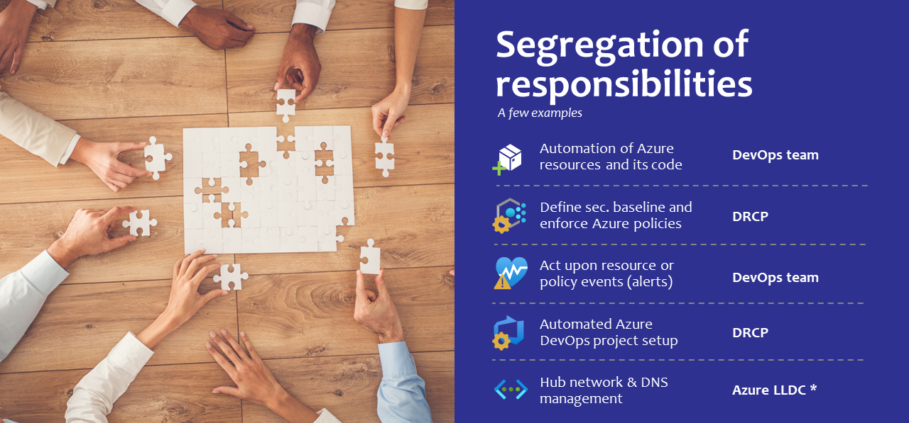
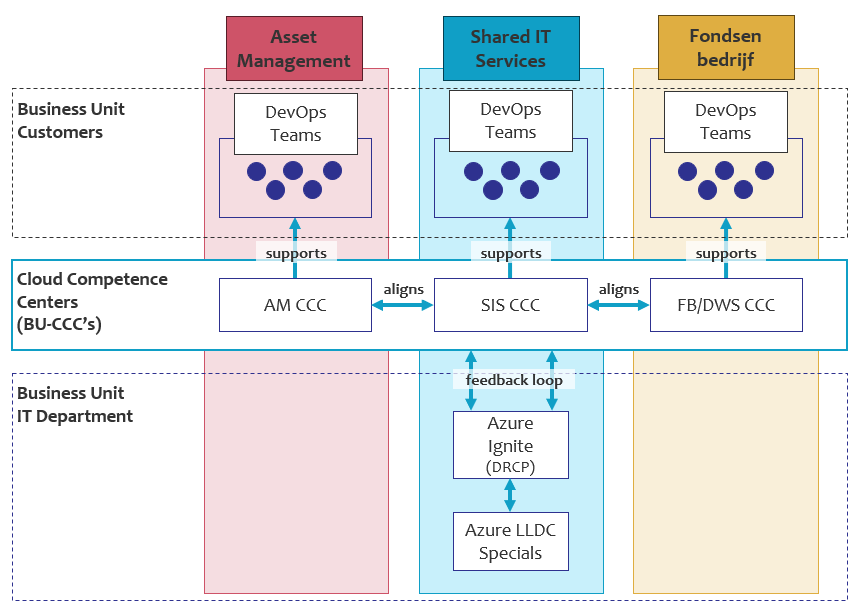

Responsibilities
================

| DevOps teams at APG need to operate conform the mantra **'you build it, you own it, you run it'**.
| This means there is a clear segregation of responsibilities between the platform providing team (team Azure Ignite), supporting teams (BU CCCs) and the DevOps teams developing new applications.

The following segregation of responsibilities is important to understand:
   * **The DRCP platform team (team Azure Ignite)** covers the security policies, guard railed components, initial Application system (AS) setup and compliance monitoring of Application systems and environments.
   * **DevOps teams** are responsible for all development and maintenance activities on their AS. They need to comply to security guidelines and adhere to best-practices. They also need to react adequately to monitoring alerts and (security) incidents.
   * **The business unit Cloud Competence Centers** verify DevOps teams have an adequate knowledge level and skills before moving to (higher TAP) usages.

.. confluence_newline::

.. confluence_newline::

