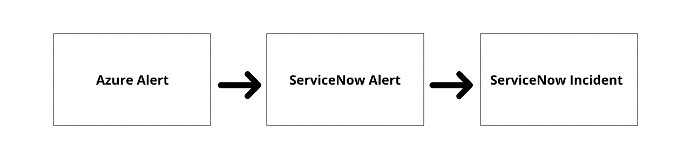
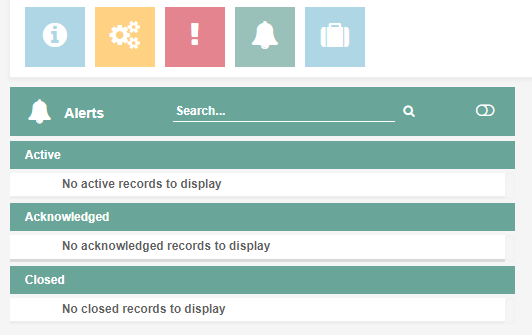

Alerts and incidents
====================

.. toctree::
   :maxdepth: 1
   :glob:
   :caption: Contents

   Alerts-and-incidents/*

Purpose
-------
This section describes how to create specific types of Custom Rules available for DevOps teams.

Alerts and incidents
====================

If discrepancies occur in Azure monitoring, the event manager creates an alert or an incident. Alerts are automatically generated if monitoring detects that certain metrics have exceeded a pre-defined threshold. Exceeding the threshold doesn't always mean that it has a negative effect on the application. In case it does have a negative effect on the application, the event manager creates an incident.

A collection of DRCP provided Azure resources and properties generate the alerts in ServiceNow:

* DRCP Resource Group named ``DRCP-EnvironmentCode-ActionGroups`` where the DRCP Action Group resides.
* DRCP Action Group named ``DRCP-EnvironmentCode-ActionGroup`` which contains the secure webhook.
* Secure webhook within DRCP Action Group which sends the events to the predefined ServiceNow event endpoint using OAuth.

.. confluence_newline::

Alerts
------
Monitoring picks up discrepancies in Azure. This results in the automatic creation of alerts when monitored metrics or alerts exceed a certain level. For example, if a policy is in-compliant. Manage the alerts (green bell) in the environment view, as shown below.

.. confluence_newline::

Each alert has a specified stage of emergency, also known as the severity. The severity shows if action is necessary.

.. list-table::
   :widths: 30 70
   :header-rows: 1

   * - Severity
     - Description
   * - Critical
     - Immediate action required. The resource is either not functional or has a critical problems.
   * - Major
     - Major functionality is severely impaired or performance has degraded.
   * - Minor
     - Partial, non-critical loss of functionality or performance degradation occurred.
   * - Warning
     - Attention required, even though the resource is still functional.
   * - Info
     - Event manager creates an alert. The resource is still functional.
   * - Clear
     - No action required. Event manager doesn't create an alert for this event. Event manager closes existing alerts.

Event manager makes a distinction between active and closed alerts.
* Active alerts are discrepancies that monitoring and logging tools have found, which still apply to the environment.
* Closed alerts are discrepancies that are already solved.

Incidents
---------
Incidents show that a discrepancy occurred that had a negative effect on the environment. ServiceNow event management creates incidents automatically for some critical alerts. The event manager assigns the incident to the support group of the environment.

