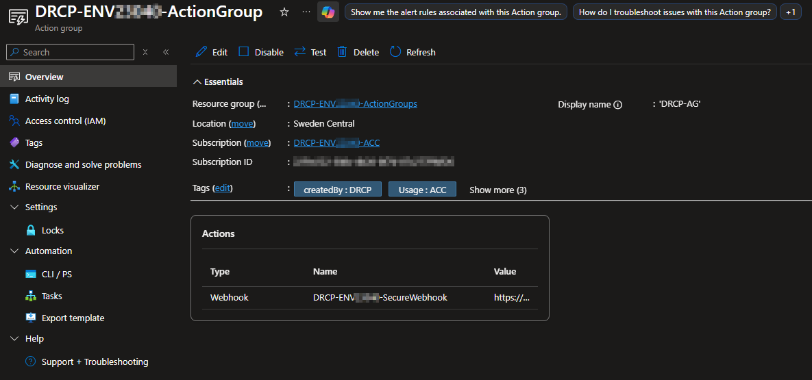
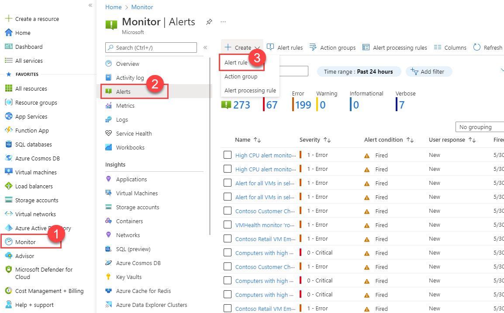
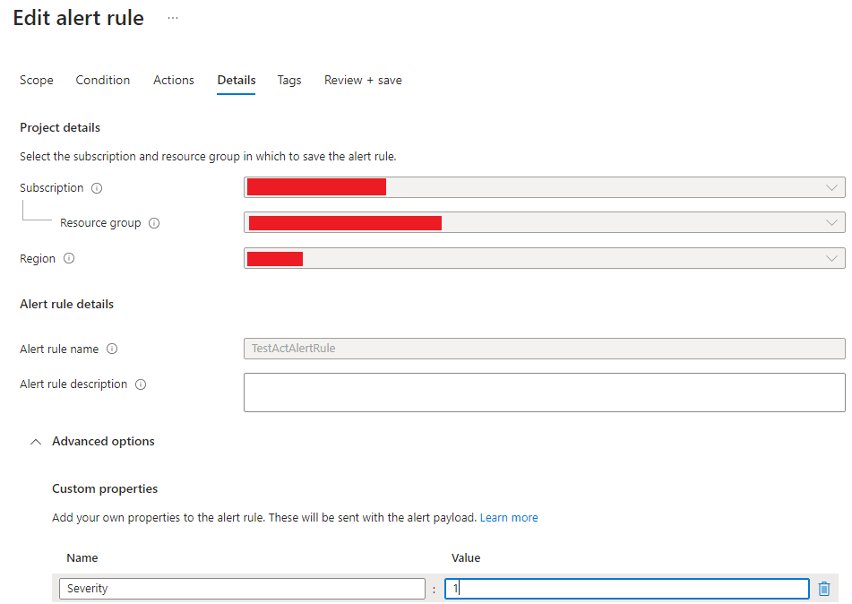

Custom Alerts Rules
====================
Azure custom alert rules track your data and capture a signal showing that something is happening on the specified resource. The custom alert rules allow you to define specific criteria based on metrics or log data, triggering alerts when conditions align with needs. By leveraging custom rules, you can address unique application needs and ensure a more granular configuration.

Within each environment, an Action Group named ``DRCP-<ENVIRONMENT>-ActionGroup`` is auto-created. This Action Group is pre-configured with an **Action** named ``DRCP-<ENVIRONMENT>-SecureWebhook`` that triggers a webhook in ServiceNow, and you should select it in the **Actions** field of all custom alert rules.

Alert rules in Azure
~~~~~~~~~~~~~~~~~~~~
| In an Azure environment, log alert rules let you track log data to trigger alerts based on defined conditions within Azure Monitor Log Analytics. These rules help detect patterns, specific events, or changes within log data that might suggest operational or security issues.
| Metric alerts in Azure provide real-time monitoring of resource performance based on specific metrics, enabling prompt responses to predefined thresholds showing performance or availability issues.

| To configure an alert rule, start by opening the Azure Portal. Go to **Monitor**, then the **Alerts** section, and click **New alert rule**. Choose the relevant scope, where you select the ``DRCP-<ENVIRONMENT>-ActionGroups`` in the hierarchy. Define the condition in the **Condition** field to specify the exact log data monitored.
| Next, set the alert logic by defining the **frequency** for how often the query should run and the **threshold** for triggering the alert. Specify the alert actions by selecting the ``DRCP-<ENVIRONMENT>-ActionGroup``. Review all configurations and activate the alert by saving it.

Activity log alert rules
~~~~~~~~~~~~~~~~~~~~~~~~
Activity log alert rules track specific administrative management activities across Azure resources, such as resource creation, deletion, or role assignments. It triggers an alert when defined actions occur.

When you configure an activity log alert to send notifications to ServiceNow, there is a one-way communication between the alert in Azure and ServiceNow. This setup means that the underlying issue triggering the alert must first resolve within Azure before the corresponding incident can be fully addressed or closed in ServiceNow. ServiceNow relies on resolution progress made in Azure for updates or status changes because it doesn't automatically receive state changes or resolution updates from Azure alerts.

Metric alert rules
~~~~~~~~~~~~~~~~~~
Metric alerts in Azure provide real-time monitoring of resource performance based on specific metrics, enabling prompt responses to predefined thresholds showing performance or availability issues.

A metric alert rule can send a "clear" event back to ServiceNow, unlike an activity log alert. To do this, select **Automatically resolve** alerts within the **Custom Details** section of the **Details** tab. When triggered, this "clear" event updates the incident status in ServiceNow to ``Resolved`` and automatically closes the incident. If the same event recurs within three days, the incident will automatically reopen in ServiceNow.

Activity log alert severity levels
~~~~~~~~~~~~~~~~~~~~~~~~~~~~~~~~~~
When you create or adjust an activity log alert rule, Azure automatically sets property ``severity`` to "Verbose" and makes it immutable to change.

To gain control of the alert severity for follow-up in ServiceNow, and to control if an incident (INC) must trigger, follow this procedure.

Go to the **Custom properties** section under the **Advanced options** panel, and add a property named ``Severity`` with an integer as value.
The table below provides an overview of the allowed severity levels, corresponding integer values, and brief explanations of each severity.

.. list-table::
   :widths: 30 30 70
   :header-rows: 1

   * - Value (integer)
     - Severity result in ServiceNow
     - Description
   * - 1
     - Critical
     - Creates a ServiceNow incident (INC12345678).
   * - 2
     - Major
     - Creates a major alert (Alert12345678) in ServiceNow, but doesn't create an incident.
   * - 3
     - Minor
     - Creates a minor alert (Alert12345678) in ServiceNow.

Mail notifications
~~~~~~~~~~~~~~~~~~
By default DevOps teams receive mail notifications for created incidents in ServiceNow. This isn't the case for alerts. For DevOps teams to receive mail notification based on alerts they can add a **Custom properties** under the **Details** tab. By adding the property ``mail`` with the value ``true`` mail notification will be send for the alerts created with this rule.

Tutorial
~~~~~~~~
Tutorials from the Microsoft Learn pages are available to help set up custom log alerts or custom metric alert rules.

- `Create a log search alert for an Azure resource <https://learn.microsoft.com/en-us/azure/azure-monitor/alerts/tutorial-log-alert>`__
- `Create a metric alert for an Azure resource <https://learn.microsoft.com/en-us/azure/azure-monitor/alerts/tutorial-metric-alert>`__

ServiceNow Connection
^^^^^^^^^^^^^^^^^^^^^
To ensure both the custom log alert rules and custom metric alert rules work with ServiceNow, it's essential **not** to create a new Action Group in the **Action** tab. Instead, select the automatically created DRCP Action Group named ``DRCP-<ENVIROMENTNAME>-ActionGroup``. Use the correct Severity values as stated in the preceding section.

Disclaimer
~~~~~~~~~~
DRCP doesn't provide support for creating or troubleshooting alert rules. Each DevOps-team handles knowledge acquisition on these features and independently troubleshoots any issues.
