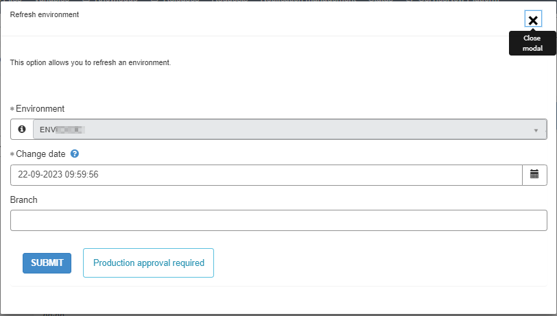
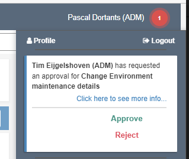

Approval overview
=================

ServiceNow approvals
--------------------

| Specific actions in the DRDC portal, listed below, require an approval from the Environment's approval group.
| Allowed options are: no approval, DTAP approval, or production approval, and shown next to the **SUBMIT** button of the request.

.. confluence_newline::

The following actions are available that might need approval from a member of the DRCP set approval group:

.. list-table::
   :widths: 20 20 10 15 10
   :header-rows: 1

   * - Name
     - Short description
     - Category
     - DRCP approval
     - Action taken by
   * - +Add (DRCP environment)
     - Add Subscription in Azure to the Application system
     - Environment
     - No approval
     - DRCP user
   * - Change maintenance details
     - Quick: change environment maintenance details
     - Quick action
     - Production approval
     - DRCP user
   * - Refresh environment
     - Quick: refresh environment
     - Quick action
     - Production approval
     - DRCP user
   * - Remove environment
     - Quick: remove environment
     - Quick action
     - Production approval
     - DRCP user

Giving DRCP approval
^^^^^^^^^^^^^^^^^^^^

When actions need DRCP approval, all members of the assigned (by default the Application system) approval group receive:

- A portal notification, shown in upper right corner of the DRDC portal.
- And an email (if not disabled in ServiceNow).

.. confluence_newline::

Azure DevOps approvals
^^^^^^^^^^^^^^^^^^^^^^

For more information about action approvals in Azure DevOps see the section about :doc:`access and permissions <../../Application-development/Azure-devops>`.