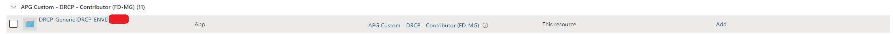
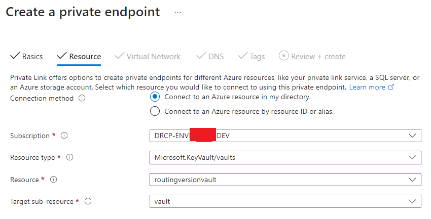
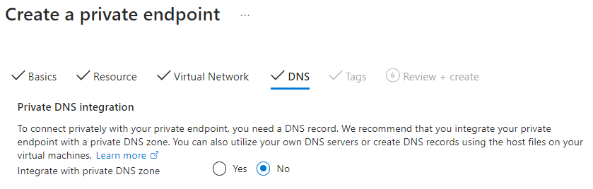

Networking
==========

.. contents::
   Contents:
   :local:
   :depth: 3

.. vale Microsoft.SentenceLength = NO

The DRCP platform in APG Landing zone 3 (LZ3) comes with out of the box networking. This page clarifies the settings, boundaries, considerations, and existing networking domain between the platform, APG corporate network and (secured) internet access.

Terminology
-----------
.. note:: Find general definitions and abbreviations :doc:`here <../Getting-started/Definitions-and-abbreviations>`.

.. list-table::
   :widths: 20 105
   :header-rows: 1

   * - Term
     - Definition

   * - Virtual Network (VNet)
     - | The Azure `Virtual Network <https://learn.microsoft.com/en-us/azure/virtual-network/virtual-networks-overview>`__  is a service that provides the fundamental building block for your private network in Azure. An instance of the service (a virtual network) enables a multitude of types of Azure resources to securely communicate with each other, the internet, and on-premises networks. These Azure resources include virtual machines (VMs).
   * - Network Security Group (NSG)
     - | The Azure `Network Security Group <https://learn.microsoft.com/en-us/azure/virtual-network/network-security-groups-overview>`__ contains security rules that allow or deny inbound network traffic to, or outbound network traffic from, some types of Azure resources. For each rule, you can specify source and destination, port, and protocol.
   * - Route Table (RT)
     - | The Azure Route Table consists of `system routes <https://learn.microsoft.com/en-us/azure/virtual-network/virtual-networks-udr-overview#system-routes>`__ (default and optional) to direct traffic within the virtual network, between virtual networks, connected networks (over VPN and Express Route) and external networks. To manipulate the traffic flows, configure `Custom routes <https://learn.microsoft.com/en-us/azure/virtual-network/virtual-networks-udr-overview#custom-routes>`__ (also known as User Defined Routes) in the Route table, which override the Azure default system routes.
   * - Activity log
     - | The Azure `Activity log <https://learn.microsoft.com/en-us/azure/azure-monitor/essentials/activity-log>`__ is a platform log in Azure that provides insight into Subscription-level events. The activity log includes information like when a resource modifies or a virtual machine starts.
   * - Diagnostic logs
     - | The Azure Diagnostic Logs <https://learn.microsoft.com/en-us/azure/azure-monitor/platform/diagnostic-settings?tabs=portal>__ provides detailed data about operations performed within Azure resources. These logs include information on resource-specific events, performance metrics, and errors. Diagnostic logs help with auditing, troubleshooting, and gaining insights into resource usage and health.
   * - Virtual network flow logs
     - | The Azure Virtual Network flow Logs <https://learn.microsoft.com/en-us/azure/network-watcher/vnet-flow-logs-overview>__ capture information about IP traffic flowing through Virtual Networks. These logs provide detailed insights into traffic patterns, including source and destination IPs, ports and protocols. Virtual Network Flow logs are useful for network monitoring, troubleshooting, and analytics.
   * - Network security group flow logs
     - | The Azure Network Security Group Flow Logs <https://learn.microsoft.com/en-us/azure/network-watcher/nsg-flow-logs-overview>__ capture detailed information about IP traffic flowing through Network Security Groups. These logs provide insights into traffic patterns, including source and destination IP addresses, ports, and protocols. Network Security Group Flow Logs are essential for monitoring network activity, troubleshooting connectivity issues, and performing security analytics. Be aware, On September 30, 2027, network security group (NSG) flow logs retires. As part of this retirement, you'll no longer be able to create new NSG flow logs starting June 30, 2025.
   * - Hub
     - | The Azure `Hub Virtual Network <https://learn.microsoft.com/en-us/azure/architecture/networking/architecture/hub-spoke>`__  hosts shared Azure services (like egress, DNS, On Premise connectivity, Azure DevOps Self-Hosted Agents, etc). Workloads hosted in the spoke virtual networks can use these services. The hub virtual network is the central point of connectivity for cross-premises networks.
   * - Spoke
     - | The Azure `Spoke Virtual Network <https://learn.microsoft.com/en-us/azure/architecture/networking/architecture/hub-spoke#spoke-network-connectivity>`__ isolates and manages workloads individually in each spoke. Each workload can include a multitude tiers, with subnets connected through Azure load balancers. Spokes can exist in different Subscriptions and represent different environments, such as Production and Non-production.
   * - Peering
     - | The Azure VNet `Peerings <https://learn.microsoft.com/en-us/azure/virtual-network/virtual-network-peering-overview>`__ are non-transitive, low-latency connections between virtual networks. Peered or connected virtual networks can exchange traffic over the Azure infrastructure without needing a router. Azure Virtual Network Manager creates and manages network groups and their connections.
   * - APG Firewalls
     - | The Palo Alto is the current Firewall which LZ3 uses to pass it's traffic through for security purposes. Firewall clusters secure traffic at (1) the Azure Hub, at the (2) APG Perimeter and (3) Data Center. Depending on the resources the traffic traverses to one or more of these firewalls.
   * - Egress (traffic)
     - | Azure Egress Traffic <https://techcommunity.microsoft.com/blog/azurenetworkingblog/controlling-data-egress-in-azure/4164307>__ refers to data transferred from Azure resources to the internet. This traffic passes through firewalls for security and compliance checks. Egress is subject to Azure's bandwidth pricing and includes scenarios such as web browsing, API calls, and data downloads from Azure to external systems.
   * - Internal (traffic)
     - | Azure Internal Traffic <https://learn.microsoft.com/en-us/azure/virtual-network/virtual-networks-overview>__ refers to data flows between Virtual Networks and on-premises networks over secure connections such as VPN or ExpressRoute. This traffic remains within the Azure infrastructure or private connections, ensuring low latency and high security. It includes inter-VNet communication and connectivity with on-premises systems for hybrid scenarios.

The DRCP provided spoke Virtual Network
---------------------------------------
| DRCP provides a VNet (also referred to as the spoke network from this point) for DevOps teams' Environments with a network address prefix that corresponds with the address prefix supplied to the DevOps teams in ServiceNow during the Environment creation process.
| The spoke network reservation is part of a larger network, calculated and reserved by APG's IPAM solution, InfoBlox.
| DevOps teams are free to carve up and create subnets within the DRCP provided spoke VNet per their needs. DRCP Automation creates, and Azure Policy protects the bi-directional peering between the spoke VNet and the APG Hub virtual network. The bi-directional peering consists of two (2) peerings, one from hub to spoke, and one from spoke to hub.

| DRCP provides a default VNet address space to your Environment on initial creation. You can't change or remove this VNet after creating it.
| It's possible to add up to two more address spaces to your Environment after creation. See page :doc:`Quick actions <DRDC-portal/Quick-actions>` for more information.

This spoke to hub VNet peering contains the following settings:

.. list-table::
   :widths: 30 20 105
   :header-rows: 1

   * - Setting in Azure Resource Manager
     - Setting value
     - Description

   * - allowVirtualNetworkAccess
     - | True
     - | This setting enables communication between spoke and hub in a hub-spoke network topology and allows a VM in the spoke VNet to communicate with a VM in the Hub VNet.

   * - allowForwardedTraffic
     - | False
     - | Enabling this option will allow the spoke VNet to receive traffic from virtual networks peered to the hub VNet. For example, if VNet-2 has an NVA that receives traffic from outside of VNet-2 that gets forwards to VNet-1, you can select this setting to allow that traffic to reach VNet-1 from VNet-2. While enabling this capability allows the forwarded traffic through the peering, it doesn't create any user-defined routes or network virtual appliances. User-defined routes and network virtual appliances remain independent of one another with regards to creation.

   * - allowGatewayTransit
     - | False
     - | Enabling this setting will allow the hub VNet to receive traffic from the Spoke VNet gateway or route server. In order for this option to function, the spoke network must contain a gateway or route server.

   * - useRemoteGateways
     - | True
     - | This option functions with the condition if that the hub VNet enables "Allow gateway in 'hub-VNet' to forward traffic to 'spoke VNet'" traffic and the hub network has a remote gateway or route server.

This hub to spoke VNet peering contains the following settings:

.. list-table::
   :widths: 30 20 105
   :header-rows: 1

   * - Setting in Azure Resource Manager
     - Setting value
     - Description

   * - allowVirtualNetworkAccess
     - | True
     - | This setting enables communication between spoke and hub in a hub-spoke network topology and allows a VM in the spoke VNet to communicate with a VM in the Hub VNet.

   * - allowForwardedTraffic
     - | False
     - | Enabling this option will allow the hub VNet to receive traffic from virtual networks peered to the spoke VNet. For example, if VNet-2 has an NVA that receives traffic from outside of VNet-2 that gets forwards to VNet-1, you can select this setting to allow that traffic to reach VNet-1 from VNet-2. While enabling this capability allows the forwarded traffic through the peering, it doesn't create any user-defined routes or network virtual appliances. User-defined routes and network virtual appliances remain independent of one another with regards to creation.

   * - allowGatewayTransit
     - | True
     - | Enabling this setting will allow the spoke VNet to receive traffic from the hub's VNet gateway or route server. In order for this option to function, the hub network must contain a gateway or route server.

   * - useRemoteGateways
     - | False
     - | This option functions with the condition if that the spoke VNet enables "Allow gateway in spoke VNet to forward traffic to 'hub VNet'" and the spoke network has a remote gateway or route server.

The Hub
-------
The Azure LLDC team manages the central hub within Azure. DRCP leverages a multitude of services offered within this hub.
These are the main services offered by the Azure LLDC team in the hub:

.. list-table::
   :widths: 30 30 60
   :header-rows: 1

   * - Service
     - Service description
     - Service relation to LZ3

   * - The hub network 'H01-P1-VirtualNetwork'
     - | Provides network connectivity with the larger APG network and hosts Azure LLDC's hub services.
     - | Enables LZ3 spokes with the ability to create connections to other spokes within LZ3 (depending on firewall rules in the Centralized firewall) or on-prem/hub services distributed across the larger APG network.

   * - Centralized firewall (Palo Alto Network Virtual Appliance)
     - | The central firewall for the Azure hub.
     - | Provides traffic analysis and routes for LZ3 when traffic moves outside of the spokes. Handles traffic to the public internet, and traffic between spokes.

   * - VPN and Express Route gateways
     - | The gateways provide the connectivity to the on-premises networks.
     - | Processes traffic to the on-premises networks. This traffic routes direct to the VPN Gateways without going through the Centralized Firewall in Azure, but the Perimeter Firewall on-premises secures this traffic flow when it exits the VPN on the APG side.

   * - Infoblox DNS
     - | Provides DNS functionality for publicly hosted domains, private DNS zones, and internal DNS zones.
     - | Provides DNS resolving for internet domains, private DNS zones linked to the Hub virtual network and APG internal hosted DNS zones and domains.

   * - Private DNS
     - | The private DNS functionality.
     - | Provides private DNS registrations by hosting a multitude of Azure Private DNS zones. These private DNS zones host DNS records in their corresponding zones so that clients can resolve private endpoints, services, and internal DNS zones (for example azurebase.net, office01.internalcorp.net, etc.).

   * - Hosting Sentinel
     - | Sentinel is a SIEM implementation hosted by Microsoft which enables its user to analyse data and actions across its coverage within Azure. It's hosted by Azure LLDC but managed by security.
     - | The Sentinel within the hub receives activity logs from LZ3 Subscriptions through a diagnostic setting, and uses its intelligence to identify anomalies in these logs.

   * - Hosting the SIEM
     - | The APG SIEM solution (IBM QRadar) monitors and analyzes activity with regards to security, access and actions for SecOps to investigate and act upon. It's hosted by Azure LLDC but managed by SecOps.
     - | The SIEM event hub (as target in the diagnostic settings of the activity logs in the LZ3 Subscriptions) sends the data to IBM QRadar to analyze these logs for anomalies.

   * - Self-hosted Azure DevOps agents
     - | Self-hosted Azure DevOps agents (Virtual Machines Scale Sets with `Generated Images <https://confluence.office01.internalcorp.net:8453/pages/viewpage.action?spaceKey=LLDCSHAS&title=LLDC+Self-Hosted+agent+versions>`__) to provide connectivity to the private networks, support long running jobs, and allow APG to control the version of the images.
     - | DRCP leverages the self-hosted agent pools (managed by Azure LLDC) for its Azure DevOps build pipelines. These are also used by the DevOps teams that leverage the DRCP platform.

Route Tables
------------
| Use `route tables <https://learn.microsoft.com/en-us/azure/virtual-network/manage-route-table>`__ to influence how traffic routes out a virtual network.
| A route table contains a set of rules (system and user defined routes) that specifies how packets should route in a virtual network. Users associate route tables with subnets, and the route table handles each packet leaving a subnet.
| Users can associate a route table with more than one subnet, but also can assign just one route table to an individual subnet.
| Packets match with routes by using the destination. This can be an IP address, a virtual network gateway, a virtual appliance, or the internet. If a matching route isn't found, then the packet drops. By default, every subnet in a virtual network associates with a set of built-in routes.
| These allow traffic between virtual machines in a virtual network, virtual machines and an address space as defined by a local network gateway, and virtual machines and the internet.

DRCP requires each subnet in the spoke virtual network to follow a route table containing the specified route.

.. list-table::
   :widths: 30 30 30 30
   :header-rows: 1

   * - Route name
     - Address Prefix
     - Next Hop Type
     - Next Hop IP Address

   * - default
     - | 0.0.0.0/0
     - | Virtual appliance
     - | 10.250.4.254

This route ensure that all internet traffic passes through the Palo Alto Network Virtual Appliance, also referred to earlier as the Azure Hub Firewall.

For connectivity to On Premise the virtual network must learn the BGP routes advertised to and by the VPN Gateway. To ensure these route are available set the ARM property ``"Microsoft.Network/routeTables/disableBgpRoutePropagation"`` to false.

Route table for application gateway subnet
~~~~~~~~~~~~~~~~~~~~~~~~~~~~~~~~~~~~~~~~~~

The Application Gateway nodes must use the public IP to communicate with Azure's control plane. Configure the subnet's route table with a default route (0.0.0.0/0) to the internet.

Other spokes peered to the hub aren't present in the local learned routes. Create User Defined Routes for these networks (summarized to 10.0.0.0/8) to the Palo Alto Virtual Appliance in the HUB as displayed in the following route table:

.. list-table::
   :widths: 30 30 30 30
   :header-rows: 1

   * - Route name
     - Address Prefix
     - Next hop type
     - Next hop IP address

   * - default
     - | 0.0.0.0/0
     - | Internet
     - |

   * - ``10.0.0.0-8``
     - | 10.0.0.0/8
     - | Virtual Appliance
     - | 10.250.4.254

For more information see :doc:`Application Gateway <../Azure-components/Application-Gateway>`.

Route table for Azure Kubernetes Service node subnet
~~~~~~~~~~~~~~~~~~~~~~~~~~~~~~~~~~~~~~~~~~~~~~~~~~~~

When using ``Kubelet``, the AKS Managed Identity requires access to the route table assigned to the node subnets. The AKS Cluster insert routes to the pods network sections on the AKS Nodes to allow pod-to-pod communication between nodes over the virtual network. The route table starts off as a normal route table as described below, but allows routes to the internal AKS networks:

.. list-table::
   :widths: 30 30 30 30
   :header-rows: 1

   * - Route name
     - Address Prefix
     - Next Hop Type
     - Next Hop IP Address

   * - default
     - | 0.0.0.0/0
     - | Virtual appliance
     - | 10.250.4.254

For more information see :doc:`Kubernetes Service <../Azure-components/Kubernetes-Service>`.

Network Security Group
----------------------
Users use a Azure Network Security Group to filter network traffic between Azure resources in an Azure virtual network. It contains prioritized security rules that allow or deny inbound network traffic to, or outbound network traffic from, specified network segments or (Azure) services. For each rule, you can specify the source and destination, port, and protocol.

DRCP enforces all spoke VNet subnets to have a Network Security Group instance associated, while the configuration of the rules within are up to the DevOps teams to configure.

DNS
---
Private DNS
~~~~~~~~~~~
| APG requires private network usage for Azure components. For each DRCP component with private link support, a private DNS zone is available in the hub. Direct management of the private DNS zones is inaccessible to DevOps teams.
| DRCP automates `Private DNS zone configuration <https://learn.microsoft.com/en-us/azure/private-link/private-endpoint-DNS-integration>`__ for private endpoints through the use of remediation policies that use a managed identity that has exclusive permissions on the private DNS zones to create, update or remove records.
| This system assigned managed identity has the required permissions to perform the remediation on the hub side and for the environment side.
| The system-assigned managed identity, named ``DRCP-Generic-<Application-System-Name>-<Environment-Code>``, automatically receives the ``DRCP custom contributor`` RBAC role on the Subscription.

.. warning:: ``DO NOT`` remove this role assignment as it will break the automatic private DNS remediation.

When creating a private endpoint with automatic DNS remediation, take not to fill in the correct subresource. Consult `Private DNS and subresources <https://learn.microsoft.com/en-us/azure/private-link/private-endpoint-DNS>`__ which value to provide for your specific resource.
For example see below Key Vault resource example with selected with subresource value "vault."

Choose to **not** integrate with Private DNS Zone to allow the remediation policies to handle it.

To achieve the same result as the portal steps for activating automatic DNS remediation, configure DNS Zone references in ARM for the Private Endpoint using the following ARM JSON.

.. vale Microsoft.SentenceLength = NO

.. code-block:: javascript

    {
      "location": "westeurope",
      "name": "keyvault-private-endpoint",
      "type": "Microsoft.Network/privateEndpoints",
      "apiVersion": "2021-05-01",
      "properties": {
          "subnet": {
              "id": "/subscriptions/xxxxxx-xxxx-xxxxxx-xxxxx/resourceGroups/DRCP-ENV12345-VirtualNetworks/providers/Microsoft.Network/virtualNetworks/DRCP-ENV12345-VirtualNetwork/subnets/examplesubnet"
          },
          "customNetworkInterfaceName": "DRCP-Documentation-Example-PE-nic",
          "privateLinkServiceConnections": [
              {
                  "name": "example-keyvault-private-endpoint-name",
                  "properties": {
                      "privateLinkServiceId": "/subscriptions/xxxxxx-xxxx-xxxxxx-xxxxx/resourceGroups/DRCP-ENV12345-VirtualNetworks/providers/Microsoft.KeyVault/vaults/examplekeyvault",
                      "groupIds": "vault"
                  }
              }
          ]
      },
      "tags": {},
      "dependsOn": []
    }

To view the records registered in the private DNS zones use the :doc:`Azure LLDC Infrastructure API for Private DNS <DRCP-API/Endpoint-for-dns-assignment>`.

Custom domains for Private DNS
~~~~~~~~~~~~~~~~~~~~~~~~~~~~~~
| The page :doc:`Custom-Domains <../Azure-components/App-Service/Custom-domain>` describes how to set custom domains and certificates on applications, including the request of an **internal** signed SSL certificate.
| The page :doc:`Request external certificate <../Application-development/Certificates/Request-external-certificate>` describes how to request an **external** signed SSL certificate.

Default routes
--------------

| With the peering configuration, the hub advertises the following routes and destinations to the virtual network in the spoke:
| - Private Link Endpoints HUB -> HUB Virtual Network
| - 10.250.0.0/21 -> HUB Virtual Network
| - 10.250.8.0/21 -> HUB Virtual Network
| - On-prem BGP advertised networks -> VPN Gateway

.. note:: Traffic to other spokes in Azure (10.240.0.0/12) will follow the 0.0.0.0/0  and thus travel over the Centralized Firewall.

Firewall rules
--------------
To achieve a spoke-to-spoke communication, request a Firewall rule for those ranges or address. As of now this is possible through the request Firewall rule form in ServiceNow `Request Firewall rules <https://apgprd.service-now.com/now/nav/ui/classic/params/target/com.glideapp.servicecatalog_cat_item_view.do%3Fv%3D1%26sysparm_id%3D29f13edcdb8c3410b00a5bd05b961908%26sysparm_link_parent%3D8b450b7d4fd9a200eec9cda28110c758%26sysparm_catalog%3D0a334d003734ee003486f01643990e3b%26sysparm_catalog_view%3Dcatalog_infrastructure_catalog>`__ .

.. note:: A temporary rule allows HTTPS traffic over ports tcp_443 and tcp_8443 between spokes of the same business unit with the same usage (that's DEV, TST, or ACC, but not PRD!). An example for allowed traffic: FB/DWS-DEV to FB/DWS-DEV, and an example for not allowed traffic: FB/DWS-ACC to FB/DWS-DEV. The latter needs firewall rules requested using the preceding procedure.