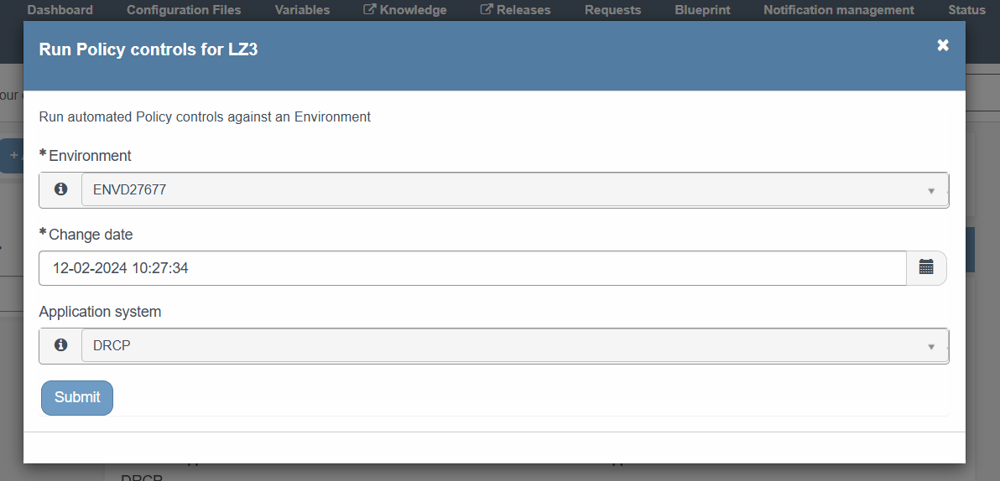
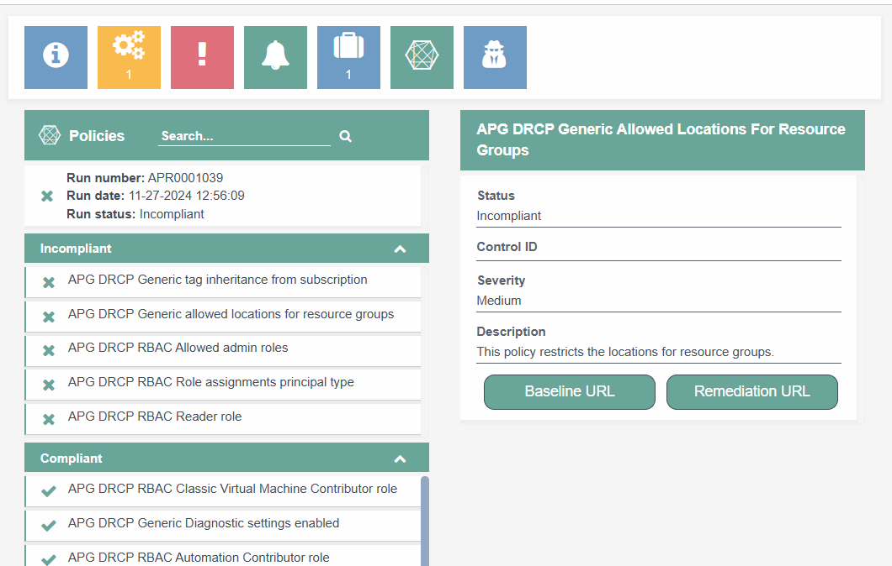
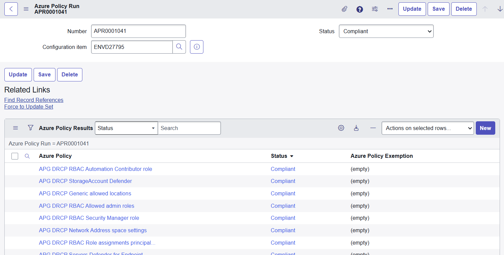
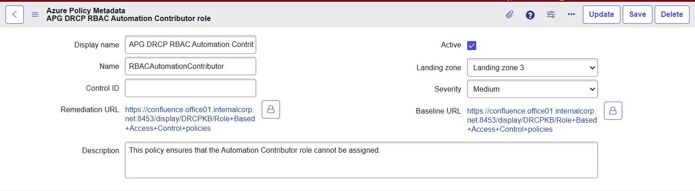

Azure Policies
==============

.. contents::
   Contents:
   :local:
   :depth: 2

Introduction
------------

Azure Policy helps to enforce organizational standards and to assess compliance at-scale. Through its compliance dashboard, it provides an aggregated view of the environment, with the ability to drill down to the per-resource, per-Policy granularity. It also helps to bring your resources to compliance through bulk remediation for existing resources and automatic remediation for new resources. See `this link <https://learn.microsoft.com/en-us/azure/governance/Policy/overview>`__ for more information about Azure Policy.

Within DRCP, `Azure Policy <https://learn.microsoft.com/en-us/azure/governance/Policy/overview>`__ is one of the instruments used to audit and enforce the security baseline controls as described in the security baseline of each :doc:`Azure component <../../Azure-components>` . For an example, see the :doc:`Subscription baseline <../../Azure-components/Subscription/Subscription-Baseline>` . Each baseline control can relate to one or more Policies, but a single Policy is always related to one control.

.. note:: For more information about the APG IT corporate policies, see `IT Policy Plaza SharePoint Site <https://cloudapg.sharepoint.com/sites/TeamAPG-DigiSquare/SitePages/ITBeleid.aspx>`__ .

Dashboard & reporting
---------------------

You can use the `Azure Policy dashboard <https://portal.azure.com/#view/Microsoft_Azure_Policy/PolicyMenuBlade/~/Overview>`__ in the Azure Portal to gain insights about the actual compliance state. You can also use the overview of your Environment in the `DRDC portal within ServiceNow <https://apgprd.service-now.com/drdc>`__ described below.

Incident
^^^^^^^^
In case a Policy is incompliant, an incident raises automatically. This incident displays the specific Policy run number that failed, but doesn't provide details of Policy results, due to APG security constraints. To gain insights in the specific Policy that failed, please find the URL within the incident that leads to the specific Policy Run, which contains more detailed insights.

Revalidate the Policy state
^^^^^^^^^^^^^^^^^^^^^^^^^^^

In case of an incompliant Azure resource getting compliant again (for example after adjusting the resource configuration), the incident closes automatically after the next Policy Run. You can force this run by using the Quick action '**Run Policy controls for LZ3**'.

DRDC Portal
^^^^^^^^^^^

The DRDC Portal show the latest Policy Run state. By clicking on the widget it show which policies are compliant and which are incompliant. By clicking on a Policy Result it shows more information of the Policy and security baseline. It's also possible to open the security baseline URL and the remediation URL from the Policy Result. To make sure the Environment is compliant, use the Quick action '**Run Policy controls for LZ3**'.

Platform
^^^^^^^^

From the ServiceNow platform it's also possible to see the Policy Run results (including the history of the previous runs). You can find the module by navigating to Azure Policies > Azure Policy Run in ServiceNow. It's also possible to open the security baseline URL and the remediation URL from the Policy Result. To make sure the Environment is compliant, use the Quick action 'Run Policy controls for LZ3'.

**Azure Policy run**

An Azure Policy run is an individual run where to check wether an Environment/Subscription is compliant. Every 24 hours the ServiceNow platform checks to see if all Environments are compliant. In case and Environment isn't compliant an incident is for the Environment.
The Azure Policy run can have one of the following states:

.. list-table::
   :widths: 30 70
   :header-rows: 1

   * - State
     - Description
   * - Compliant
     - All Policy results are Compliant or Compliant by Exemption.
   * - Incompliant
     - At least one of your Policy results is Incompliant.

**Azure Policy result**

An Azure Policy result is an individual status of a Policy for a specific Environment. All resources within one Environment/Subscription with the same Policy gets aggregated towards one Policy run in ServiceNow.
The Azure Policy result can have one of the following states:

.. list-table::
   :widths: 30 70
   :header-rows: 1

   * - State
     - Description
   * - Compliant
     - The Policy is compliant for all the resources in your Environment.
   * - Incompliant
     - The Policy is incompliant for at least one resources in your Environment.
   * - Compliant by Exemption
     - The Policy is compliant due to an Exemption on the Subscription or Application system.
