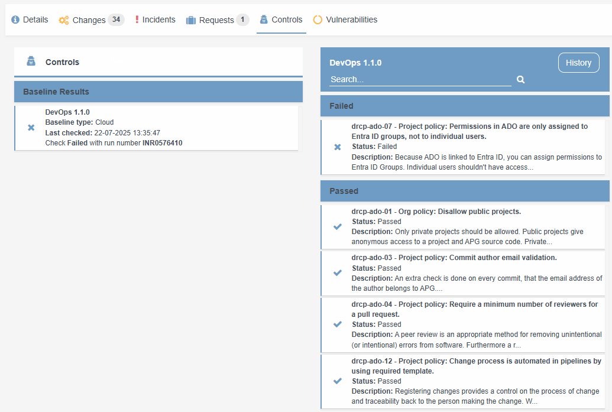
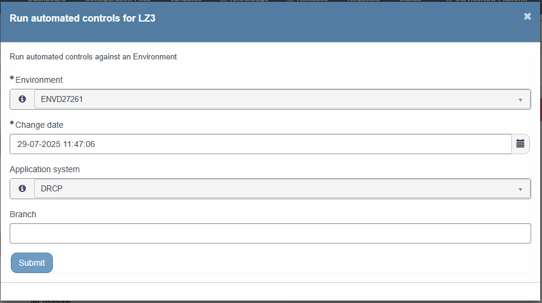

Controls
========

.. contents::
   Contents:
   :local:
   :depth: 2

Introduction
------------

DRCP uses Controls for auditing security baselines when Azure policies aren't available.

.. note:: For more information about the APG IT corporate policies, see `IT Policy Plaza SharePoint Site <https://cloudapg.sharepoint.com/sites/TeamAPG-DigiSquare/SitePages/ITBeleid.aspx>`__ .

Dashboard & reporting
---------------------

In case a Control is incompliant, an incident raises automatically. This incident shows a URL of more information. By following the URL it shows all controls and results.
The DRDC portal shows the latest Control state. By clicking on a Control it shows the complete Cinc result.

Revalidate the Control state
----------------------------

In case of an incompliant Azure resource getting compliant again (for example after adjusting the resource configuration), the incident closes automatically after the next Control Run. You can force this run by using the Quick action '**Run automated controls for LZ3**'. This Quick action is available for both the Application system and the environment.
