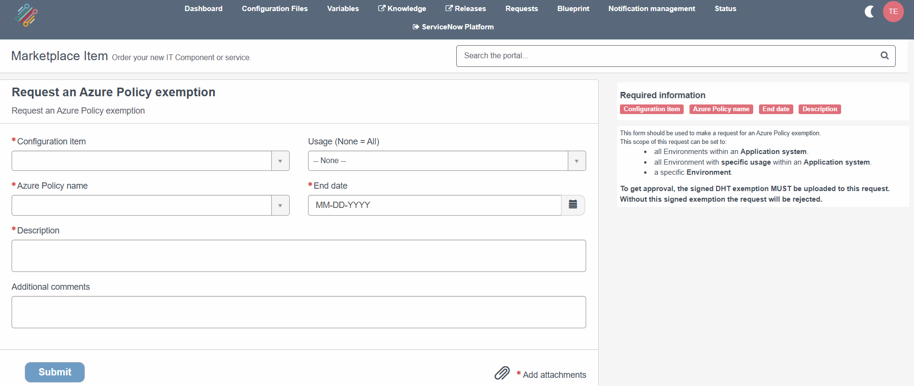

DRCP exceptions
===============

.. contents::
   Contents:
   :local:
   :depth: 2

Introduction
------------

Applying the APG-wide measures determined by the security baselines may cause unintended setbacks in corporate process execution in specific cases. In such cases, follow an exception procedure to deviate from the corporate APG IT Policy in a controlled manner and manage associated risks within the defined risk tolerance.

`This procedure <https://cloudapg.sharepoint.com/sites/TeamAPG-DigiSquare/SitePages/ITBeleid.aspx>`__ outlines the process for handling exceptions and includes the required forms. It applies across the entire APG organization and addresses exceptions that can span business units.

.. note:: The term '`Policy Exemption <https://learn.microsoft.com/en-us/azure/governance/policy/concepts/exemption-structure>`__' described in this page refers to the technical solution of Microsoft Azure to apply a (functional described) IT exception to a given (set of) Policy/Policies.

.. note:: The request process outlined below applies to scenarios in which the scope limits to a specific DRCP policy. It's incompatible with scenarios in which the exception is more specific or granular. For example, when the policy should remain working for other scenarios in your Environments. Please contact your PO for help.

To request an DRCP exception, you're required to provide a DHT-signed approval. Follow the process described on the `IT Policy Plaza SharePoint Site <https://cloudapg.sharepoint.com/sites/TeamAPG-DigiSquare/SitePages/ITBeleid.aspx>`__ first. Then, you can follow the process described below. This process deviates from the Microsoft documentation which describes to use the Azure Portal.

Requesting & refreshing an exception
^^^^^^^^^^^^^^^^^^^^^^^^^^^^^^^^^^^^
From a technical perspective, the ServiceNow CMDB manages and stores policy exemptions and security baseline exceptions. While creating or refreshing an Environment the automation sets the exception on your Subscription (Environment).

You can request an exception through ServiceNow by opening the `DRDC portal <https://apgprd.service-now.com/drdc>`__. In the navigation bar, navigate to '`Request <https://apgprd.service-now.com/drdc?id=drdc_sc_ce_index>`__' and find the '**Request DRCP exception**' request button:

1. Select your Configuration item, which could be an Application system or an Environment.
2. Select the Usage if you select an Application system. This determines which Subscription will receive the exception.
3. Select if you would like to have an exception for a policy or a security baseline run.
4. Select the policy or security baseline id you need an exception for from the pull-down list.
5. Select the end date provided in the DHT document.
6. Fill out the Description.
7. Upload the signed DHT docoument.
8. Submit the request.

After approval:

9. Use the Quick-action: **Refresh Environment** to make the new exception available on your Subscription or wait until a Maintenance run.

DRCP validates whether the information provided in the request matches the signed DHT document. If it does, DRCP approves the request, and all Subscriptions related to the exception will receive the exception after a refresh.

Exemption notification
^^^^^^^^^^^^^^^^^^^^^^
.. warning:: ServiceNow will send you an email one month and seven days before the exception expires, prompting you to refresh your exception. You can do this by requesting a new exception and providing a new signed DHT document as described on this page.

.. warning:: Letting an exemption expire **may** lead to disrupting workloads, such as (but not limited to) blocked to (re)-apply infa-as-code changes to your solution in Azure. In case an existing exception needs to renew, please ensure to follow the described process in time!
