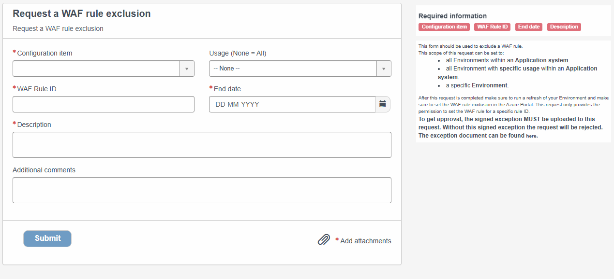
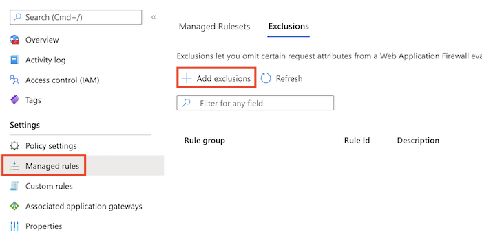

WAF rule exclusion
==================

.. contents::
   Contents:
   :local:
   :depth: 2

Introduction
------------

Applying the APG-wide measures determined by the security baselines may cause unintended setbacks in corporate process execution in specific cases. In such cases, follow an exception procedure to deviate from the corporate APG IT Policy in a controlled manner and manage associated risks within the defined risk tolerance.

`This procedure <https://cloudapg.sharepoint.com/sites/TeamAPG-DigiSquare/Gedeelde%20documenten/Forms/AllItems.aspx?id=%2Fsites%2FTeamAPG%2DDigiSquare%2FGedeelde%20documenten%2FIT%20Beleid%2FProcedure%20Exceptie%20IT%20Beleid%20versie%201%2E2%20%2D%20Final%2Epdf&parent=%2Fsites%2FTeamAPG%2DDigiSquare%2FGedeelde%20documenten%2FIT%20Beleid>`__ outlines the process for handling exceptions and includes the required forms. It applies across the entire APG organization and addresses exceptions that can span business units.

.. note:: The request process outlined below applies to scenarios in which the scope limits to a specific DRCP WAF rule exclusion. It's incompatible with scenarios in which the exception is more specific or granular. Please contact your PO for help.

To request an WAF rule exclusion, you're required to provide a DHT-signed approval. Follow the process described on the `IT Policy Plaza SharePoint Site <https://cloudapg.sharepoint.com/sites/TeamAPG-DigiSquare/SitePages/ITBeleid.aspx>`__ first. Then, you can follow the process described below.

Requesting & refreshing an WAF rule exclusion
^^^^^^^^^^^^^^^^^^^^^^^^^^^^^^^^^^^^^^^^^^^^^
From a technical perspective, the ServiceNow CMDB manages and stores WAF Rule exlusions and sets them to your Subscription (Environment) during creating or refreshing the Environment.

You can request a WAF rule exclusion through ServiceNow by opening the `DRDC portal <https://apgprd.service-now.com/drdc>`__. In the navigation bar, navigate to '`Request <https://apgprd.service-now.com/drdc?id=drdc_sc_ce_index>`__' and find the '**Request a WAF rule exlusion**' request button:

1. Select your Configuration item, which could be an Application system or an Environment.
2. Select the Usage if you select an Application system. This determines which Subscription will receive the Policy exemption.
3. Fill out the WAF rule ID.
4. Select the end date provided in the DHT document.
5. Fill out the Description.
6. Upload the signed DHT docoument.
7. Submit the request.

After approval:

8. Use the Quick-action: **Refresh Environment** to make the WAF rule exlusion to apply to the policy in your Subscription or wait until a Maintenance run.

DRCP validates whether the information provided in the request matches the signed DHT document. If it does, DRCP approves the request, and all Subscriptions related to the WAF rule exclusion gets the applied exclusion in the policy after a refresh.

9. To apply the WAF exclusion rule in the Azure portal go to **Application Gateway WAF Policy**. Under settings select **Managed rules** and in the top select **Exclusions**. Add the exclusion by selecting **Add exclusion** and fill out the form.

Exemption notification
^^^^^^^^^^^^^^^^^^^^^^
.. warning:: ServiceNow will send you an email one month and seven days before the WAF rule exclusion expires, prompting you to refresh your exclusion. You can do this by requesting a new WAF rule exclusion and providing a new signed DHT document as described on this page.

.. warning:: Letting an WAF rule exclusion expire **may** lead to disrupting workloads, such as (but not limited to) blocked to (re)-apply infa-as-code changes to your solution in Azure. In case an existing exclusion needs to renew, please ensure to follow the described process in time!
