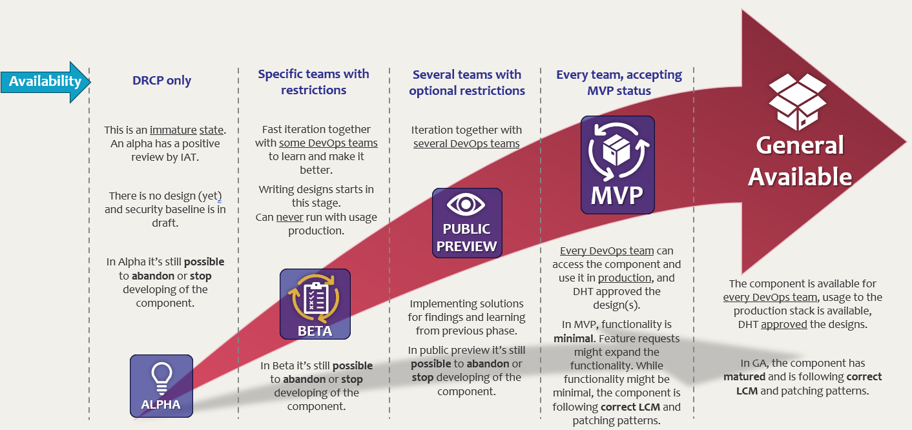

Building block phases
=====================

| This page describes the building block phases that apply to the :doc:`Azure components of DRCP <../Azure-components>`.
| Be aware that code is always propagated to production. The table below indicates the uses of the building block within the DRCP production stack.
| The 'Azure Knowledge Group' aims to reduce unnecessary discussions about how Azure works and focus on the specific technical issue. The goal of this informal check is to avoid oversights in the designs that can incur undue harm to the APG organisation.

|phases|

.. list-table::
   :widths: 10 20 10 10 10 10 20
   :header-rows: 1

   * - Phase
     - Description
     - Design
     - Security Baseline
     - Available for
     - Stack/usage
     - Communication
   * - Alpha
     - The building block is available to the DRCP team. This is a immature state. An alpha has a positive review by IAT (IRIS Architecture Team, peer reviews). In Alpha it's still possible to abandon or stop developing of the building block.
     - No
     - Not approved
     - DRCP internal
     -
     -
   * - Beta
     - Fast iteration together with some DevOps teams to learn and make the building block better. Writing designs starts in this stage. Can never run with usage production. In Beta it's still possible to abandon or stop developing of the building block.
     - In progress
     - In progress
     - Specific teams, restrictions and arrangements apply
     - D
     - Developers of the DRCP communicate changes made to the building block directly to the specific teams that uses the beta building block. Extend beta's to development environments of production stacks after agreement from the 'Azure Knowledge group'.
   * - Public Preview
     - Iteration together with some DevOps teams, implementing solutions for findings and learning from previous phase. Complete design and get approval of the design by DHT. After an approved design it might be possible to provision usage test, acceptance, and production. Running usage test, acceptance or production might be possible with extra approvals, restrictions or extra rules and way of working. In public preview it's still possible to abandon or stop developing of the building block. Offering the building block with usage test, acceptance or production requires the approval of the design by the DHT and the security baseline.
     - Ready, in approval stage or already approved
     - Ready, in approval stage or already approved
     - Some teams, restrictions and arrangements might still apply
     - D(TAP)
     -
   * - MVP (Minimum Viable Product)
     - Every DevOps team can access the building block and use it in production, DHT approved the designs. Functionality is minimal. Feature requests might expand the functionality. While functionality might be minimal, the block is following correct LCM and patching patterns.
     - Approved
     - Approved and checked
     - Every team, but they accept the MVP status, things missing aren't defects, they're feature requests.
     - DTAP
     - Developers of the DRCP write changes made to the building block in the release notes (if applicable) starting from the MVP..
   * - GA (General Available)
     - The building block is available for every DevOps team, usage to the production stack is available, DHT approved the designs. Building block has matured and is following correct LCM and patching patterns.
     - Approved
     - Approved and checked
     - Every team
     - DTAP
     -

