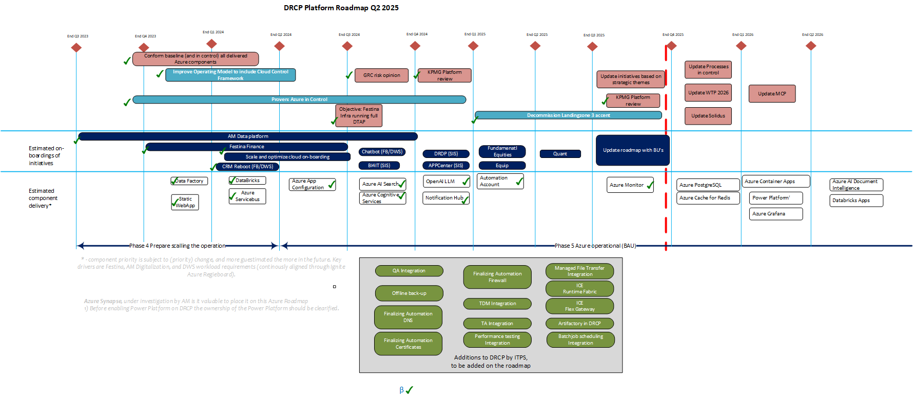
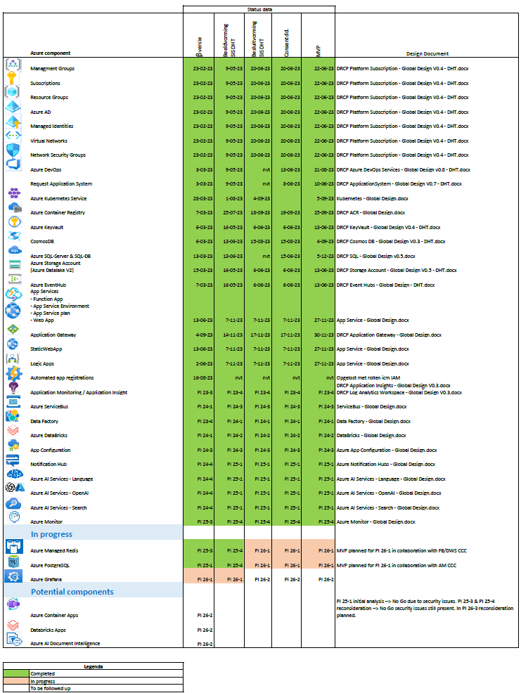

Roadmap
=======

.. contents::
   Contents:
   :local:
   :depth: 2

Introduction
------------

| This section outlines the DRCP platform and components roadmap. The DRCP platform develops guardrailed Azure components following the approach of :doc:`building block phases <Building-block-phases>`.
| The product owner (PO) maintains and periodically updates the roadmap (typically once per PI).
| Any questions related to the roadmap and prioritization can be directly addressed to the PO.

Platform roadmap
----------------

| The platform roadmap outlines the key activities per quarter, estimated onboarding initiatives and estimated component delivery.
| Last update: **15-Dec-2025**.

.. confluence_newline::

Components roadmap
------------------

| The components roadmap provides details on expected component delivery, expected status per component (:doc:`building block phase <Building-block-phases>`) and expected usage by APG customers (DevOps teams).
| Last update: **15-Dec-2025**.

.. confluence_newline::

