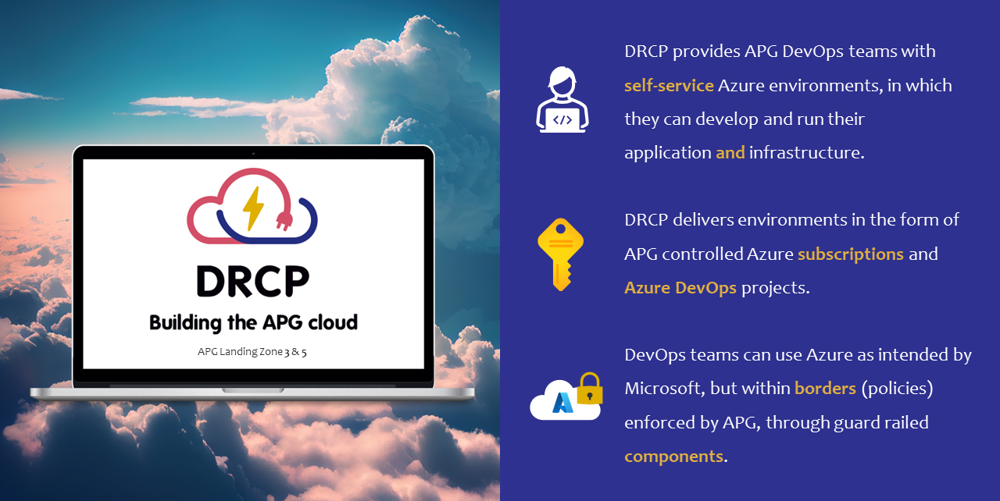

DRCP knowledge base
===================

.. toctree::
   :maxdepth: 1
   :caption: Contents
   :glob:

   *

.. confluence_newline::

.. note:: **Important:** Check the :doc:`Release notes <Release-notes>` section frequently (prefer after each release). Use the **Watch** function to get notified and avoid unexpected impact on your applications.

Welcome to DRCP
----------------
Welcome to the DRCP knowledge Base (KB), maintained by team Azure Ignite, which is part of Shared IT Services - Value Stream IT Platform Services.

| The DRCP KB provides a central location for all information about the DRCP platform and how to work APG compliant with Azure Cloud on APG Landing zones 3 and 5.
| It provides DevOps teams with information for :doc:`getting started <Getting-started>` with DRCP and further guidance on their :doc:`Application development <Application-development>`.
| Foremost it provides information about the available guard railed :doc:`Azure components <Azure-components>`, their security baselines and use-cases.

* The :doc:`Platform <Platform>` section provides background information on how the DRCP platform is setup.
* The :doc:`Processes <Processes>` section explains the DRCP development workflow including the component building block phases.
* The :doc:`Release notes <Release-notes>` section covers new features and important changes deployed in recent releases, important for DevOps teams to understand and track for impact.
* The :doc:`Need help <Need-help>` page provides more information about communication channels with involved teams for incidents, Q&A and more.

DRCP platform
-------------
| DRCP stands for :doc:`DevOps Ready Cloud Platform <Getting-started/Definitions-and-abbreviations>` and provides DevOps teams with guard railed :doc:`components <Azure-components>` to develop secure and APG compliant on Microsoft Azure Cloud.
| DRCP also provides a self-service platform for deploying these components to an :doc:`Application system <Getting-started/Definitions-and-abbreviations>` using Azure DevOps (also referred as ADO).
| DevOps teams can request and Application system via ServiceNow, after consulting their business unit Cloud Competence Center (BU CCC).
| DevOps teams are in the lead of developing their application and can manage their own :doc:`environments <Getting-started/Definitions-and-abbreviations>` in the form of APG controlled Azure Subscriptions (one per DTAP usage).
| The DRCP platform enforces guardrails in the form of Azure policies to ensure DevOps teams follow a compliant development workflow within APG security boundaries.

.. confluence_newline::

Business Unit Cloud Competence Centers
--------------------------------------
| To improve Azure Cloud adoption and provide a one-stop shop for DevOps teams with Azure Cloud related questions, APG introduced the business unit Cloud Competence Centers (BU CCCs).
| Every business unit has its own CCC, facilitating DevOps teams within its own business unit with activities like:

   1. Azure Cloud knowledge and documentation
   2. Onboarding to Azure Cloud (LZ3/LZ5)
   3. Skills assessment
   4. Solution review
   5. Start architecture support

.. note:: | The BU CCC SIS is the one-stop Azure Cloud shop for SIS DevOps teams.
  | Are you a SIS DevOps team that wants to get in touch with the BU CCC SIS? Please get in contact via Microsoft Teams following `this link <https://teams.microsoft.com/l/channel/19%3a_p_zLiPXw3RKf9JVvASNbSLiClvnfF2yatqW8do-1t81%40thread.tacv2/General?groupId=4949f184-94f8-4524-b604-d92d25c2e022&tenantId=c1f94f0d-9a3d-4854-9288-bb90dcf2a90d>`__.
